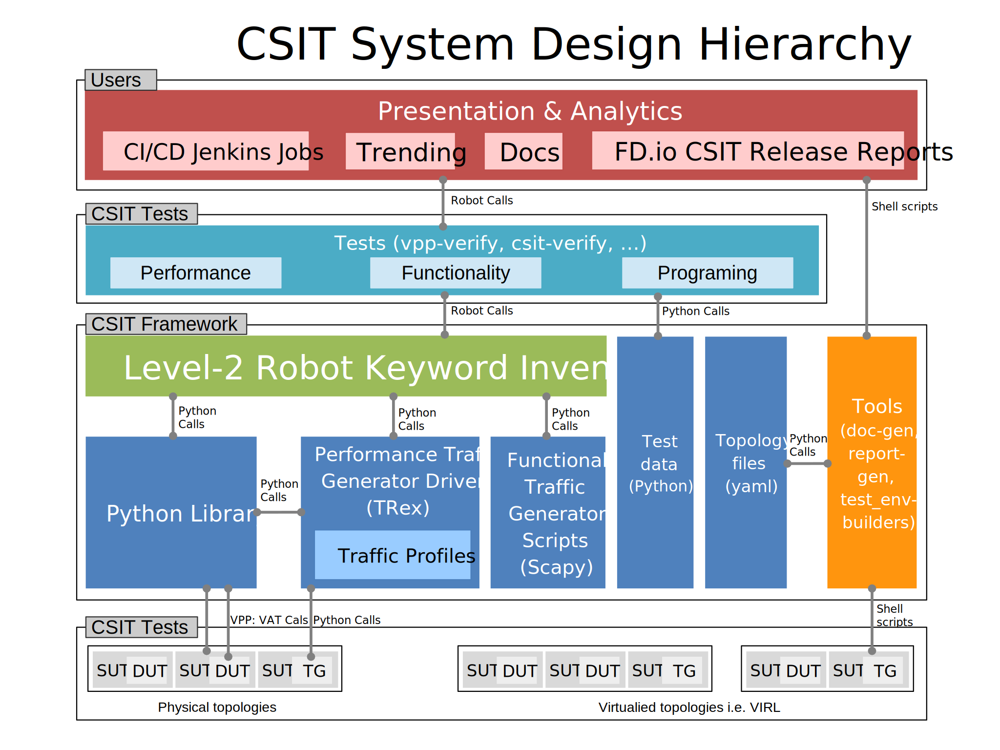

# CSIT - Continuous System Integration Testing

1. [Architecture](#architecture)
1. [Directory Structure](#directory-structure)
   1. [Tests](#tests)
   1. [Keywords](#keywords)
   1. [Other Resources](#other-resources)
1. [Quickstart](#quick-start)
   1. [Vagrant](#vagrant)
   1. [Physical Testbed](#physical-testbed)
1. [Report](#report)
1. [Trending](#trending)
1. [Code Documentation](#code-documentation)
1. [Coding Guidelines](#coding-guidelines)

## Architecture

FD.io CSIT system design needs to meet continuously expanding requirements of
FD.io projects including VPP, related sub-systems (e.g. plugin applications,
DPDK drivers) and FD.io applications (e.g. DPDK applications), as well as
growing number of compute platforms running those applications. With CSIT
project scope and charter including both FD.io continuous testing AND
performance trending/comparisons, those evolving requirements further amplify
the need for CSIT framework modularity, flexibility and usability.

CSIT follows a hierarchical system design with SUTs and DUTs at the bottom level
of the hierarchy, presentation level at the top level and a number of functional
layers in-between. The current CSIT system design including CSIT framework is
depicted in the figure below.



A brief bottom-up description is provided here:

1. SUTs, DUTs, TGs
   - SUTs - Systems Under Test;
   - DUTs - Devices Under Test;
   - TGs - Traffic Generators;
1. Level-1 libraries - Robot and Python
   - Lowest level CSIT libraries abstracting underlying test environment, SUT,
     DUT and TG specifics;
   - Used commonly across multiple L2 KWs;
   - Performance and functional tests:
     - L1 KWs (KeyWords) are implemented as RF libraries and Python
       libraries;
   - Performance TG L1 KWs:
     - All L1 KWs are implemented as Python libraries:
       - Support for TRex only today;
   - Performance data plane traffic profiles:
     - TG-specific stream profiles provide full control of:
       - Packet definition – layers, MACs, IPs, ports, combinations thereof
         e.g. IPs and UDP ports;
       - Stream definitions - different streams can run together, delayed,
         one after each other;
       - Stream profiles are independent of CSIT framework and can be used
         in any T-rex setup, can be sent anywhere to repeat tests with
         exactly the same setup;
       - Easily extensible – one can create a new stream profile that meets
         tests requirements;
       - Same stream profile can be used for different tests with the same
         traffic needs;
   - Functional data plane traffic scripts:
     - Scapy specific traffic scripts;
1. Level-2 libraries - Robot resource files
   - Higher level CSIT libraries abstracting required functions for executing
     tests;
   - L2 KWs are classified into the following functional categories:
     - Configuration, test, verification, state report;
     - Suite setup, suite teardown;
     - Test setup, test teardown;
1. Tests - Robot
   - Test suites with test cases;
   - Functional tests using VIRL environment:
     - VPP;
     - Honeycomb;
     - NSH_SFC;
     - DMM;
     - TLDK;
   - Performance tests using physical testbed environment:
     - VPP;
     - DPDK-Testpmd;
     - DPDK-L3Fwd;
     - Honeycomb;
     - VPP Container K8s orchestrated topologies;
   - Tools:
     - Documentation generator;
     - Report generator;
     - Testbed environment setup ansible playbooks;
     - Operational debugging scripts;

## Directory Structure

### Tests

```
.
└── tests
    ├── dmm
    │   └── func                    # DMM functional VIRL tests
    ├── dpdk
    │   ├── dpdk_scripts            # DPDK helper scripts
    │   └── perf                    # DPDK performance tests
    ├── honeycomb
    │   ├── func                    # Honeycomb functional VIRL tests
    │   └── perf                    # Honeycomb functional performance tests
    ├── kubernetes
    │   └── perf                    # VPP K8S orchestration performance tests
    ├── nsh_sfc
    │   ├── func                    # NSH_SFC functional tests
    │   └── sfc_scripts             # NSH_SFC helper scripts
    ├── tldk
    │   ├── func                    # TLDK functional VIRL tests
    │   ├── tldk_scripts            # TLDK helper scripts
    │   └── tldk_testconfig         # TLDK test configuration
    └── vpp
        ├── device                  # VPP device tests
        ├── func                    # VPP functional VIRL tests
        └── perf                    # VPP performance tests
```

### Keywords

```
.
resources
└── libraries
    ├── bash
    │   ├── config
    │   ├── entry                   # Main bootstrap entry directory
    │   ├── function                # Bootstrap function library
    │   ├── qemu_patches            # Custom QEMU patches (see KVM methodology)
    │   └── shell                   # Various functions
    ├── python                      # Python L1 KWs
    └── robot                       # Robot Framework L2 KWs
```

### Other Resources

```
.
├── docs                            # Main documentaion
├── PyPI                            # PyPI packages provided by CSIT
│   ├── jumpavg
│   └── MLRsearch
├── resources
│   ├── templates                   # Templates (vpp_api_test, kubernetes, ...)
│   ├── test_data                   # Robot Test configuration
│   ├── tools
│   │   ├── disk-image-builder      # Utilities for building (DCR, VM) images
│   │   ├── doc_gen                 # Code documentation generator
│   │   ├── papi                    # PAPI driver
│   │   ├── presentation            # Report generator
│   │   ├── scripts                 # Various tools
│   │   ├── testbed-setup           # Physical testbed setup scripts
│   │   ├── topology                # Helper scripts for topology manipulation
│   │   ├── trex                    # TRex driver
│   │   ├── vagrant                 # VPP device vagrant environment
│   │   ├── virl                    # VIRL helper scripts
│   │   └── wrk                     # WRK driver
│   ├── topology_schemas
│   ├── traffic_profiles            # Performance tests traffic profiles
│   │   ├── trex
│   │   └── wrk
│   └── traffic_scripts             # Functional tests traffic profiles
│       ├── dhcp
│       ├── honeycomb
│       └── lisp
└── topologies                      # Linux Foundation topology files
    ├── available
    └── enabled
```

## Quickstart

### Vagrant

[Vagrant environment preparation](docs/testing_in_vagrant.rst) documentaion is
describing local VPP Device functional testing.

### Physical Testbed

[Physical testbed preparation](resources/tools/testbed-setup/README.rst)
documentation is describing PXE and Ansible setup process. All the software
requirements for running Performance Teste are part of Ansible playbooks.

## Report

[CSIT Report](https://docs.fd.io/csit/master/report/).

## Trending

[CSIT Trending](https://docs.fd.io/csit/master/trending/).

## Code Documentation

[CSIT Code Documentation](https://docs.fd.io/csit/master/doc/).

## Coding Guidelines

If you are interested in contributing, please see the
[coding guidelines](docs/test_code_guidelines.rst).

