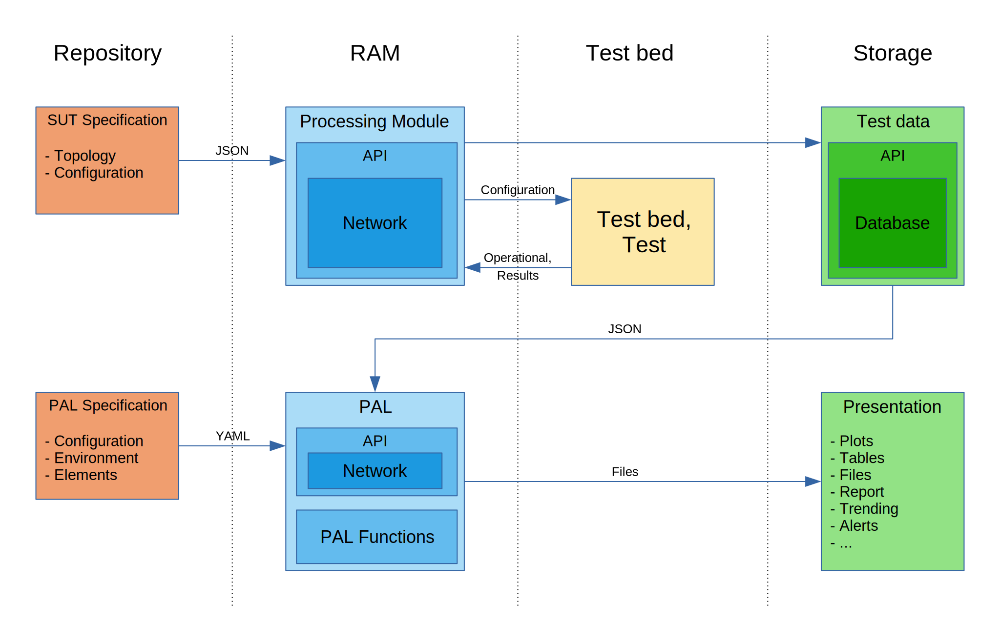

-------------------------------------------------------------------------------
# CSIT-2.0

Version 0.1.0

-------------------------------------------------------------------------------

### Content

- [CSIT-2.0](#csit-20)
    + [Content](#content)
    + [Changelog](#changelog)
    + [Note](#note)
    + [Overview](#overview)
- [The Model](#the-model)
  * [Components](#components)
    + [SUT Specification](#sut-specification)
    + [Processing Module](#processing-module)
    + [Test Bed and Test](#test-bed-and-test)
    + [Test Data](#test-data)
    + [PAL](#pal)
    + [PAL Specification](#pal-specification)
    + [Presentation](#presentation)
  * [Procedure](#procedure)
- [Test Definition](#test-definition)
  * [Files Defining the Test](#files-defining-the-test)
  * [Suite and Test Definition](#suite-and-test-definition)
    + [Version](#version)
    + [Metadata](#metadata)
    + [Resource](#resource)
    + [Network](#network)
      - [Node](#node)
      - [Link](#link)
    + [Suite](#suite)
    + [Test](#test)
- [Unified Test Interface](#unified-test-interface)
  * [Top-level structure](#top-level-structure)
  * [State](#state)
  * [Current State](#current-state)
  * [Command History](#command-history)
  * [Test Results](#test-results)
    + [Execution](#execution)
    + [Results](#results)
      - [The structure of results](#the-structure-of-results)
    + [Examples](#examples)
  * [Unified Test Interface Lifecycle](#unified-test-interface-lifecycle)
    + [Initialisation](#initialisation)
    + [Data Collection](#data-collection)
    + [Providing the Collected Data](#providing-the-collected-data)
- [Implementation](#implementation)
  * [Design](#design)
  * [Tools and Libraries](#tools-and-libraries)

### Changelog

| Version  | Changes                                                          |
|----------|------------------------------------------------------------------|
| 0.1.0    | Initial revision                                                 |

### Note

The keywords "MUST", "MUST NOT", "REQUIRED", "SHALL", "SHALL NOT", "SHOULD",
"SHOULD NOT", "RECOMMENDED", "MAY", and "OPTIONAL" in this document are to be
interpreted as described in [RFC 2119](https://tools.ietf.org/html/rfc2119
"Key Words for use in RFCs to Indicate Requirement Levels").

### Overview

This document describes the new design of configuring and running tests
and collecting the operational data and results produced by them. It deals with

- the [The Model](#the-model) - brief description of the model itself.
- the [Test Definition](#test-definition) as a set of definition files which is
  a full and the only description of the SUT and test itself;
- the [Unified Test Interface](#unified-test-interface) which is the only
  output of a test (results, operational data, counters).
- the [Implementation](#implementation)

-------------------------------------------------------------------------------

# The Model



## Components

Components stored in the repository:
- [SUT Specification](#sut-specification)
- [PAL Specification](#pal-specification)

Components running in RAM and keeping all data in RAM during the runtime:
- [Processing Module](#processing-module),
- [PAL](#pal)

Component running on a testbed by CI/CD:
- [Test Bed and Test](#test-bed-and-test)

Components stored in a data storage:
- [Test Data](#test-data),
- [Presentation](#presentation)

### SUT Specification

SUT specification is a set of files ([example](examples/input_test_definition))
containing the full information about the system under test. It includes mainly
information about:

- resources,
- topology,
- configuration,
- placeholders for operational data and results.

For more information see the section
[Test Definition](#test-definition).

### Processing Module

When a test starts, an instance of the processing module is created. It reads
the SUT specification and creates a model of the tested network topology.
Then it passes the configuration information to the test.

While the test runs, it continuously collects operational data and passes it
to the processing module together with the results. All collected information
is preserved even the test fails in a fatal way.

At the end, the data is transformed to the JSON format and sent to the storage
by CI/CD tool.

### Test Bed and Test

Test running on a test bed created and configured by the processing module with
data from SUT Specification and providing all operational data and results back
to the processing module.

### Test Data

All information about a test (topology, test bed configuration, DUT
configuration, operational data, results, ...) stored in a database.

### PAL

Presentation and Analytics Layer (PAL) makes possible to present and
analyse the test results generated by CSIT Jenkins jobs.

### PAL Specification

PAL specification is a YAML file
([example](../../resources/tools/presentation/specification.yaml)) which
specifies all elements to generate by PAL.

It is not necessary to modify the current version, but there is a place for
optimization.

### Presentation

The presentation includes all elements generated by PAL and published.

## Procedure

1. Create the instance of "Test Data Processing" module.
1. Read the specification of the test bed and test.
1. Create the test bed and configure it.
1. Configure the test.
1. Run the test.
1. Collect data while running the test. The data must be collected separately
   for each test.
1. Collect the results from the test. The results must be collected separately
   for each test.
1. Save the test data locally. Save all collected data and results even
   the test / suite / build fails.
1. Upload all data to the storage.

-------------------------------------------------------------------------------

# Test Definition

The **test definition** or topology model is considered to be an
**input information**. It includes all information to
- allocate resources,
- build the topology,
- configure all elements in the topology and
- perform the test.

The test definition is composed of:

1. topology specification,
1. specification common for all tests in a suite, and
1. test specification.

See an example [here](examples/input_test_definition)

## Files Defining the Test

The proposed directory and file structure:

```text
topology/
 - topology files (yaml)
suites/
 - suite definitions (json)
```

Topology files define the testbeds, their nodes and NICs.
Suite definition files define the test suites and tests in them.

## Suite and Test Definition

The suite and test definition is a JSON file which includes the information
about the resources, network, its nodes and links. It specifies its setup and
configuration and collects its states and operational data.

The topology is described as a network by nodes with termination points and
links between them. Each element in this model has attributes, some of them
have configuration data. See below.

See the [model](suite_specification.json) and an 
[example](examples/input_test_definition/suites/2n1l-10ge2p1x710-ethip4-ip4base-ndrpdr.json)

```json
{
  "version": "0.1.0",
  "metadata": {},
  "resource": [],
  "network": [],
  "suite": {},
  "test": []
}
```

### Version

Version of the specification. Versioned is the structure of the specification
not data in it. This key MUST be present in the specification and its name
MUST NOT be changed. Its value MUST be changed after each update of the
structure. It consists of three parts separated by a dot: MAJOR.MINOR.PATCH.
Increment the:
  - MAJOR version when the changes are incompatible with the previous version,
  - MINOR version when the changes are backwards compatible with the previous
    version, and
  - PATCH version when the changes are backwards compatible bug fixes.

The version of the data specification, and the version of this document MUST be
the same.

### Metadata

Key-value pairs defining the metadata of the model. It is a placeholder, not
specified yet.

### Resource

```json
{

  "resource": [
    {
      "resource-id": "str",
      "resource-type": "str",
      "parent": "str resource-id",
      "attr": {},
      "children": "list of resource-id",
      "configuration": "dict depends on resource-type"
    },
    {}
  ]

}
```

Resource is a list of hardware and virtual resources needed to build the
testbed. There can be listed chassis, processor cores, memory, interfaces,
containers, ..., and their relationship (parent, child).

**resource-id**

Unique ID identifying the resource. The ID is unique within the model.

**resource-type**

The type of the resource, e.g.:
- chassis,
- processor core,
- memory,
- interface, ...

**attr**

Key-value pairs defining the attributes of the resource, e.g. size of memory if
the resource is a RAM.

**parent**

`resource-id` of the parent resource. There can be only one parent for the
resource. If the `parent` is not defined (this key does not exist), the
resource is not a nested resource.

**children**

List of children of the resource. It includes the `resource-id` of all
resources directly nested in this resource. If the `children` is empty, or it
is not defined (this key does not exist), the resource has no nested resources.

**configuration**

A dictionary specifying the pre-configuration of the resource. If the resource
is not configurable, this key does not exist.

### Network

```json
{
  
  "network": [
    {
      "network-id": "str",
      "attr": {
        "nodes": "int",
        "topology": "str relative or full path"
      },
      "node": [],
      "link": []
    },
    {}
  ]
  
}
```

A network is defined by [nodes](#node) with termination points connected by
[links](#link).

The item `network` in the model is a list as there can be more than one
network specified. They CAN be multiple logical network topologies that are or
are not interconnected.

**network-id**

Unique ID identifying the network. The ID is unique within the model.

**attr**

Key-value pairs defining the attributes of the network.

- *nodes* - number of nodes in the topology.
- *topology* - the file defining the topology of the test bed

**node**

List of nodes in the network, see [Node](#node).

**link**

List of links connecting the nodes, see [Link](#link).

#### Node

A node in the network CAN be software providing a network function (e.g. VPP)
or a container, VM, etc.

A node can include zero, one, or more nested nodes. The node with nested
node(s) is the parent, a node nested in another node is its child.

```json
{

  "network": [
    {

      "node": [
        {
          "node-id": "str",
          "node-type": "str TG | DUT | ...",
          "node-topo": "str node ID used in topology file",
          "parent": "str node-id",
          "children": "list of node-ids",
          "resource": "str resource-id or list of resource-id",
          "configuration": {
            "pre-configuration": [],
            "run-time": []
          },
          "termination-point": []
        }
      ]

    }
  ]

}
```

**node-id**

Unique ID identifying a node in the network.

**node-type**

The functional type of the node, e.g.:
- traffic generator,
- DUT, ...

**node-topo**

Node identification used in the topology file. This parameter refers to the
node defined in the topology file.

**parent**

`node-id` of the parent node. There can be only one parent for the node. If the
`parent` is not defined (this key does not exist), or it is an empty string,
the node is not a nested node.

**children**

List of children of the node. It includes the `node-id` of all nodes nested in
this node. If the `children` is empty, or it is not defined (this key does not
exist), the node has no nested nodes.

**resource**

A list of resources used by this node.

**configuration**

Configuration of the node. The structure of this item depends on the
`node-type` of the node. The structure of the configuration MUST be JSON
compatible.

- *pre-configuration* - the configuration used before DUT starts
- *run-time* - the configuration used to configure the DUT while it
  runs, e.g. to configure it for the specific test. If the DUT is reconfigured
  during its run-time, this item is a list with configurations in the correct
  order.

Example of run-time configuration for the `node-type == TG`:
- *traffic-profile* - the path to the traffic profile used for the test. Traffic
  profile depends on the TG used.
- *traffic-specification* - JSON data structure fully describing all parameters
  of the traffic used for the test.

> **NOTE:** The items `traffic-profile` and `traffic-specification` are covered
> in a separate document.
>
> **TODO:** Add a link to the document.

**termination-point**

A termination point is a point belonging to a node which makes possible to
connect nodes by links.

```json
{

        "termination-point": [
          {
            "tp-id": "str",
            "attr": {}
          },
          {}
        ]

}
```

Each termination point MUST have a unique ID and CAN have a set of attributes.

#### Link

Nodes are connected to each other by links which begin and end in termination
points.

```json
{
  "network": {

    "link": [
      {
        "link-id": "str",
        "attr": {},
        "end-1": {
          "end-1-node": "node-id",
          "end-1-tp": "tp-id"
        },
        "end-2": {
          "end-2-node": "node-id",
          "end-2-tp": "tp-id"
        }
      },
      {}
    ]

  }
}
```

**link-id**

Unique ID identifying a link in the network.

**attr**

Key-value pairs defining the attributes of the link.

**end-1**

The node and the termination point where the link connected to the node.

**end-2**

The node and the termination point where the link connected to the node.

### Suite

```json
{

  "suite": {
    "suite-id": "str fullname",
    "test-type": "str [NDRPDR | MRR | SOAK | ...]",
    "tags": ["str", "list of suite specific tags"],
    "documentation": "str"
  }

}
```

**suite-id**

*Current state*

The `suite-id` must be structured as it is in the current version of CSIT, so
the test generator is able to create the tests/suites.

*Proposal to the future*

The `suite-id` is a unique (in the whole database of tests) string assigned to
the suite when it is created the first time and never changed. If it is changed,
it means, the suite/test has been changed.

It will be independent of the full test name. So, if the full name changes
(change of test name, suite name or directory tree), it will be still
identified by this ID. It would be the best solution for the time series
(trending) and comparison tables. However, the suite (or test) generator must
respect it.

**test-type**

The `test-type` specifies what and how MUST be tested. Using this information,
the test generator includes the right testing method into the test.

**tags**

List of suite tags common to all tests in the suite.

**documentation**

Suite documentation.

> NOTE: The documentation must be independent of the test type.


**Example:**

```json
{

  "suite": {
    "suite-id": "tests.vpp.perf.ip4.2n1l-10ge2p1x710-ethip4-ip4base",
    "test-type": "NDRPDR",
    "tags": ["NDRPDR", "2_NODE_SINGLE_LINK_TOPO", "BASE", "DRV_VFIO_PCI", "ETH", "ethip4-ip4base", "..."],
    "documentation": "RFC2544: Pkt throughput IPv4 routing test cases [Top] Network Topologies: TG-DUT1-TG 2-node ..."
  }

}
```

### Test

```json
{

  "test": [
    {
      "parameters": ["str", "list of parameters used in other key-value pairs"],
      "test-id": "str test name with parameters",
      "tags": ["str", "list of test specific tags, parameters can be used"],
      "framesize": ["str", "list of values"],
      "core": ["str", "list of values"]
    },
    {}
  ]

}
```

**parameters**

List of parameters (e.g. frame size or number of cores) used to generate tests.
These parameters MUST be defined in this section. See the example below.

**test-id**

Unique ID within the suite. The parameters can be used here, see example below.

**tags**

List of test specific tags. Do not repeat those defined in the suite. The
parameters can be used here, see example below.

**frame size**

List of frame sizes.

**core**

List of numbers of cores.

**Examples:**

Using parameters in this example we will get 12 tests - all combinations of
cores and frame sizes:

```json
{

  "test": [
    {
      "parameters": ["framesize", "core"],
      "test-id": "{framesize}-{core}-ethip4-ip4base",
      "tags": ["{framesize}", "{core}"],
      "framesize": ["64B", "1518B", "9000B", "IMIX"],
      "core": ["1C", "2C", "4C"]
    }
  ]

}
```

Using parameters in this example we will get 6 tests - all frame sizes for 1C
and 64B frame size for 2C and 4C:

```json
{

  "test": [
    {
      "parameters": ["framesize", "core"],
      "test-id": "{framesize}-{core}-ethip4-ip4base",
      "tags": ["{framesize}", "{core}"],
      "framesize": ["64B", "1518B", "9000B", "IMIX"],
      "core": ["1C"]
    },
    {
      "parameters": ["framesize", "core"],
      "test-id": "{framesize}-{core}-ethip4-ip4base",
      "tags": ["{framesize}", "{core}"],
      "framesize": ["64B"],
      "core": ["2C", "4C"]
    }
  ]

}
```

-------------------------------------------------------------------------------

# Unified Test Interface

The described JSON data structure is a single source of output data from a
test. The data included in it is collected during the setup and testing phases
of each test. At the end a dedicated RF keyword prints created JSON structure
as a human-readable string into the output.xml file, level info. It is not
necessary to print it as the test message. The information can be then parsed
out and processed by PAL.

The **unified test interface** is considered to be an
**output information**. It MUST provide all information. It includes the same
information as the [Test Definition](#test-definition) and
- test results,
- operational data,
  - states, the resources, nodes and test went through,
  - run-time data,
  - counters.

See the [UTI specification](unified_test_interface.json) and
[examples](examples/output_uti).

## Top-level structure

```json
{
  "version": "0.1.0",
  "metadata": {},
  "resource": [],
  "network": [],
  "state": [],
  "current-state": {},
  "test": {}
}
```

The items

- version,
- metadata,
- resource and
- network

are the same and with the same structure as defined in
[Test Definition](#test-definition).

The items

- network --> node --> command-history
- state,
- current-state  and
- almost all items in `test`

are filled with data during the runtime of the test.

## State

This item lists all states the chronological order. There also MUST
be a timestamp to make possible to reconstruct the state of the whole network.

```json
{

  "state": [
    {
      "origin": {
        "type": "str node | resource | test | ...",
        "id": "str node-id | resource-id | test-id | ..."
      },
      "state-id": "str",
      "timestamp": "datetime",
      "operational-data": {}
    },
    {}
  ]

}
```

**origin**

A part of the system where the state changed and the data comes from.

**state-id**

Identification of the state.

**timestamp**

The date and time when the state changed.

**operational-data**

The operational data collected at the particular state.

> TODO: Specify the full list of states.

## Current State

The current state of the whole system. It is changed each time an item is
appended to the `state`. This information is important in a situation when
the test fails.

```json
{

  "current-state": {}

}
```

> TODO: Specify the structure of current-state

## Command History

Some nodes CAN be configured by a set of commands during the test. This item
lists them in the chronological order. There also MUST be a timestamp to make
possible to reconstruct the command flow in the context of the whole network.

```json
{
  
  "network": [
    {
      "network-id": "str",
      "attr": {
        "nodes": "int",
        "topology": "str relative or full path"
      },
      "node": [
        {
          "node-id": "str",
          "node-type": "str TG | DUT | ...",
          "node-topo": "str node ID used in topology file",
          "parent": "str node-id",
          "children": "list of node-ids",
          "resource": "str resource-id or list of resource-id",
          "command-history": [
            {
              "timestamp": "datetime",
              "command": "str",
              "return-code": "int",
              "response": "str"
            },
            {}
          ],
          "termination-point": []
        }
      ],
      "link": []
    }
  ]
  
}
```

> **TODO:** Data type of "command" and "response" : str or JSON?

## Test Results

```json
{
  
  "test": {
    "test-id": "str fullname",
    "test-type": "str [NDRPDR | MRR | SOAK | ...]",
    "tags": ["str", "list of all tags"],
    "documentation": "str",
    "execution": {
      "ci": "str [jenkins | s5ci | manual]",
      "job": "str",
      "build": "int",
      "csit-commit": "hash",
      "csit-gerrit-change": "str url",
      "start_time": "str datetime",
      "end_time": "str datetime",
      "status": "str [PASS | FAIL]"
    },
    "results": {
      "test": {},
      "node": []
    }
  }
  
}
```

Here is a list of attributes which are not described in [Test](#test) or are
changed:

**test-id**

The test ID is composed of suite ID and previous test ID with all parameters
replaced by their values.

**tags**

Full list of tags composed of the suite tags, test tags and tags generated
during the execution, e.g. `2T1C`.

**documentation**

Test, not the suite, documentation.

### Execution

Parameters of test execution, e.g. status and executor (e.g. Jenkins) and its
base parameters e.g. job name and build number.

- *csit-gerrit-change* - If it does not exist, use empty string.

### Results

Results of the test. Their structure and items present in it, depend on the
test type.

There are two main sections:

**test**

The structure of the test results depends on the test type, see below.

**node**

It is a list of nodes with data from counters.

#### The structure of results

**NRDPDR**

```json
{

    "results": {
      "test": {
        "ndr": {
          "unit": "str",
          "value": {
            "lower": "float",
            "upper": "float"
          }
        },
        "pdr": {
          "unit": "str",
          "value": {
            "lower": "float",
            "upper": "float"
          }
        },
        "hdrh": {
          "forward": {
            "pdr-90": "str",
            "pdr-50": "str",
            "pdr-10": "str",
            "pdr-0": "str"
          },
          "reverse": {
            "pdr-90": "str",
            "pdr-50": "str",
            "pdr-10": "str",
            "pdr-0": "str"
          }
        }
      },
      "node": [
        {
          "node-id": "str",
          "termination-point": [
            {
              "tp-id": "str",
              "pdr": {
                "rx-counters": {},
                "tx-counters": {},
                "error-counters": {},
                "show-runtime-node-counters": {}
              },
              "ndr": {
                "rx-counters": {},
                "tx-counters": {},
                "error-counters": {},
                "show-runtime-node-counters": {}
              }
            },
            {}
          ]
        },
        {}
      ]
    }

}
```

**MRR**

```json
{

    "results": {
      "test": {
        "unit": "str",
        "receive-rate": "list of floats"
      },
      "node": [
        {
          "node-id": "str",
          "termination-point": [
            {
              "tp-id": "str",
              "mrr": {
                "rx-counters": {},
                "tx-counters": {},
                "error-counters": {},
                "show-runtime-node-counters": {}
              }
            },
            {}
          ]
        }
      ]
    }

}
```

**soak**

```json
{

    "results": {
      "test": {
        "unit": "str",
        "value": {
          "lower": "float",
          "upper": "float"
        }
      }
    }

}
```

> TODO: Describe the structure of results of currently existing test types.

### Examples

**NDRPDR**

Source: [64B-1c-ethip4-ip4base-ndrpdr](https://logs.fd.io/production/vex-yul-rot-jenkins-1/csit-vpp-perf-report-coverage-2101-2n-clx/1/archives/log.html.gz#s1-s1-s1-s1-s4-t1)

Example: [UTI NDRPDR](examples/output_uti/uti_example_ndrpdr.json)

**MRR**

Source: [64B-1c-ethip4-ip4base-mrr](https://logs.fd.io/production/vex-yul-rot-jenkins-1/csit-vpp-perf-report-iterative-2101-2n-clx/53/archives/log.html.gz#s1-s1-s1-s2-s4-t1)

Example: [UTI MRR](examples/output_uti/uti_example_mrr.json)

**Soak**

Source: [64B-1c-ethip4-ip4base-soak](https://logs.fd.io/production/vex-yul-rot-jenkins-1/csit-vpp-perf-report-iterative-2101-2n-clx/58/archives/log.html.gz#s1-s1-s1-s2-s2-t1)

Example: [UTI Soak](examples/output_uti/uti_example_soak.json)

## Unified Test Interface Lifecycle

TODO

### Initialisation

TODO

### Data Collection

TODO

### Providing the Collected Data

TODO

-------------------------------------------------------------------------------

# Implementation

TODO

## Design

TODO

## Tools and Libraries

TODO

[NetworkX](https://networkx.org/documentation/stable/index.html
"NetworkX - Network Analysis in Python")
