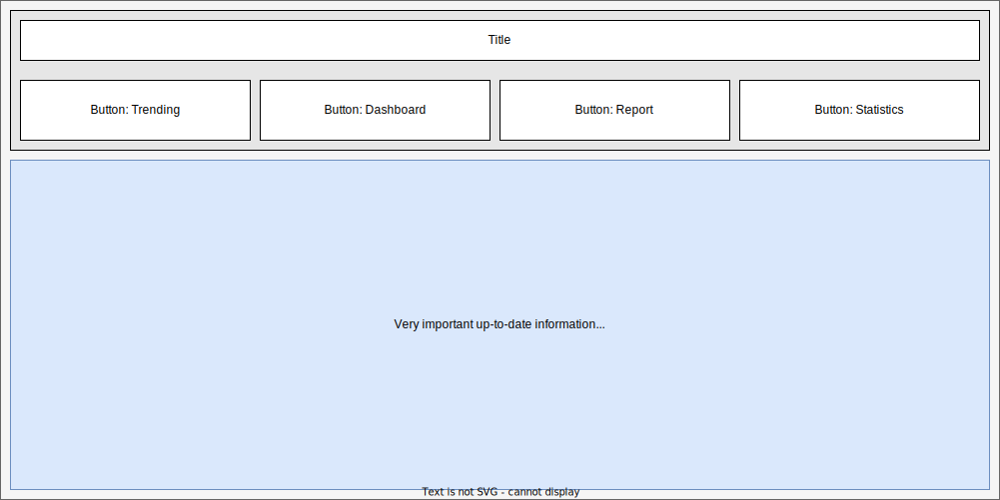
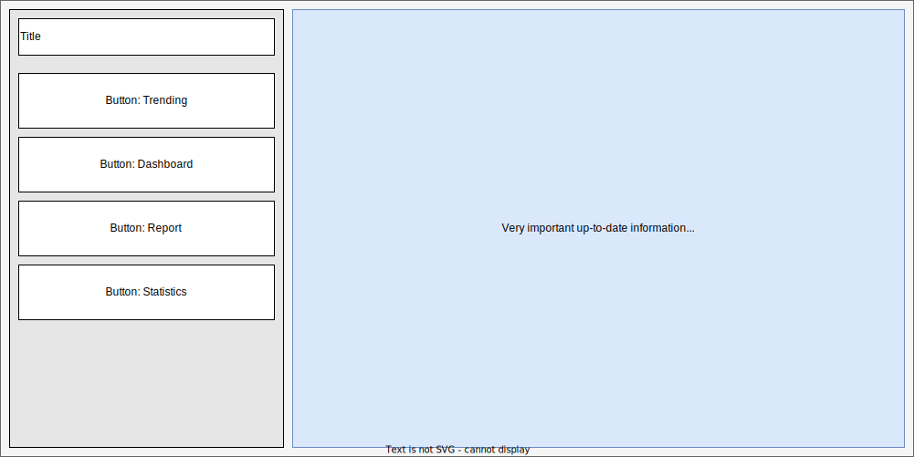
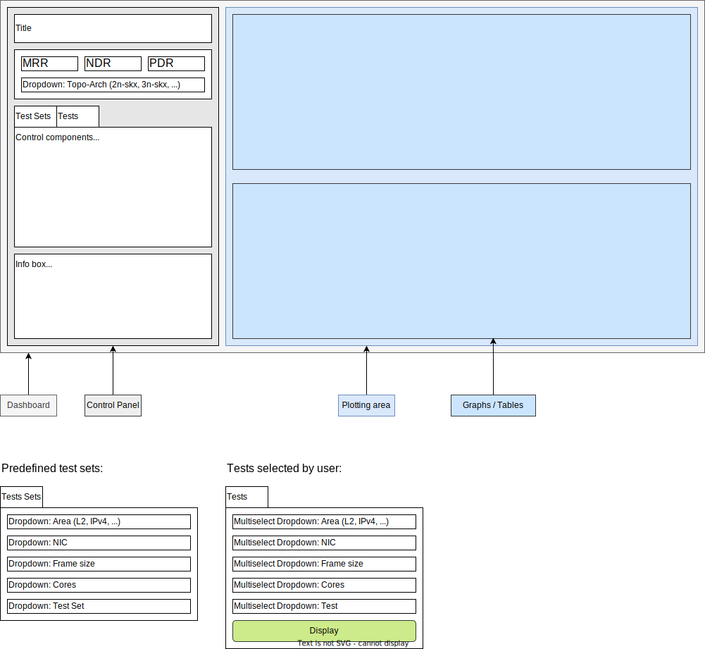
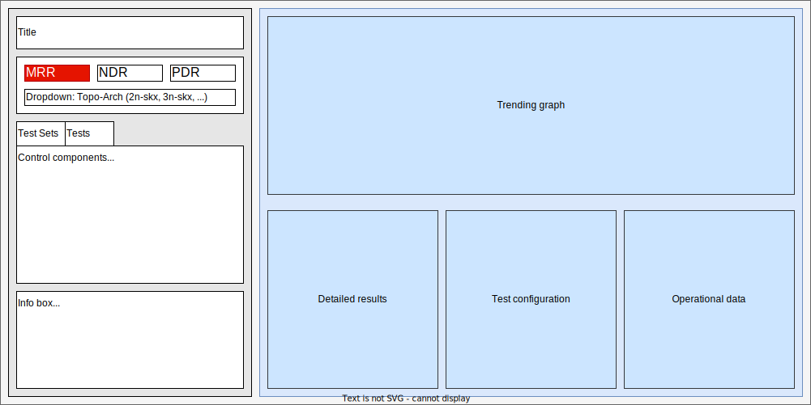
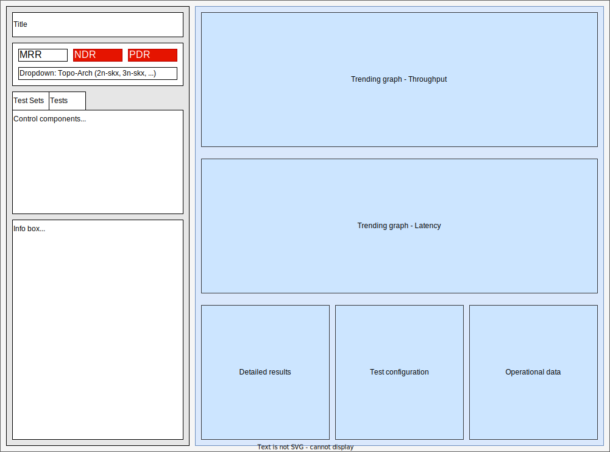

# Layout

Document version: 0.1.0

This document describes the layout of Trending and Report web pages generated
using plot.ly Dash.

## Main Page

Horizontal layout:

Vertical layout:

## Trending

### Layout

This layout is used for all pages except the main page.

Control components:

### MRR

### NDRPDR

## Dashboard

TODO

## Report

TODO

## Statistics

TODO
