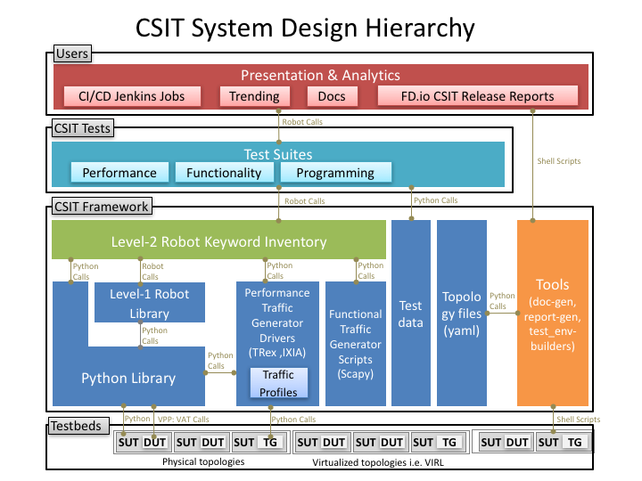

CSIT Design
===========

FD.io CSIT system design needs to meet continuously expanding requirements of
FD.io projects including VPP, related sub-systems (e.g. plugin applications,
DPDK drivers) and FD.io applications (e.g. DPDK applications), as well as
growing number of compute platforms running those applications. With CSIT
project scope and charter including both FD.io continuous testing AND
performance trending/comparisons, those evolving requirements further amplify
the need for CSIT framework modularity, flexibility and usability.

CSIT System Design Hierarchy
----------------------------

CSIT follows a hierarchical system design with SUTs and DUTs at the bottom
level, and presentation level at the top level, with a number of functional
layers in-between. The current CSIT design including CSIT framework is depicted
in the diagram below.

A brief bottom-up description is provided here:

#. SUTs, DUTs, TGs:

    - SUTs - Systems Under Test;
    - DUTs - Devices Under Test;
    - TGs - Traffic Generators;

#. Level-1 libraries - Robot and Python:

    - Lowest level CSIT libraries abstracting underlying test environment, SUT,
      DUT and TG specifics;
    - Used commonly across multiple L2 KWs;
    - Performance and functional tests:

      - L1 KWs (KeyWords) are implemented as RF libraries and Python
        libraries;

    - Performance TG L1 KWs:

      - All L1 KWs are implemented as Python libraries;

        - Support for TRex only today;
        - Need to add IXIA;

    - Performance data plane traffic profiles:

      - TG-specific stream profiles provide full control of:

        - Packet definition – layers, MACs, IPs, ports, combinations thereof
          e.g. IPs and UDP ports;
        - Stream definitions - different streams can run together, delayed,
          one after each other;
        - Stream profiles are independent of CSIT framework and can be used
          in any T-rex setup, can be sent anywhere to repeat tests with
          exactly the same setup;
        - Easily extensible – one can create a new stream profile that meets
          tests requirements;
        - Same stream profile can be used for different tests with the same
          traffic needs;

    - Sunctional data plane traffic scripts:

      - Scapy specific traffic scripts;

#. Level-2 libraries - Robot resource files:

    - Higher level CSIT libraries abstracting required functions for executing
      tests;
    - L2 KWs are classified into the following functional categories:

      - Configuration, test, verification, state report;
      - Suite setup, suite teardown;
      - Test setup, test teardown;

#. Tests - Robot:

    - Test suites with test cases;
    - Functional tests using VIRL environment:

      - VPP;
      - HoneyComb;

    - Performance tests using physical testbed environment:

      - VPP;
      - Testpmd;

    - Tools:

      - Documentation generator;
      - Report generator;
      - Testbed environment setup ansible playbooks;
      - Operational debugging scripts;

RF Keywords Functional Classification
-------------------------------------

CSIT RF KWs are classified into the functional categories matching the test
lifecycle events described earlier. All CSIT RF L2 and L1 KWs have been grouped
into the following functional categories:

#. Configuration;
#. Test;
#. Verification;
#. StateReport;
#. SuiteSetup;
#. TestSetup;
#. SuiteTeardown;
#. TestTeardown;

Coding guidelines
-----------------

More information can be found onf fd.io wiki:
`Design Optimizations <https://wiki.fd.io/view/CSIT/Design_Optimizations>`
