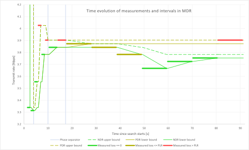
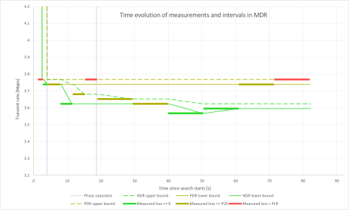
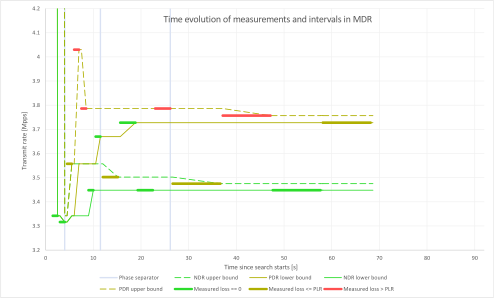
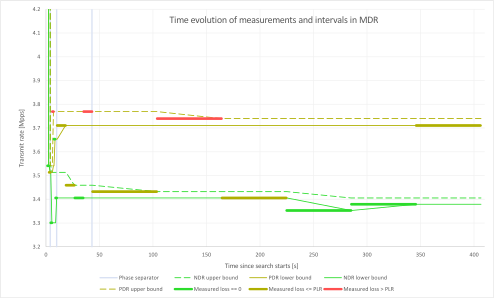
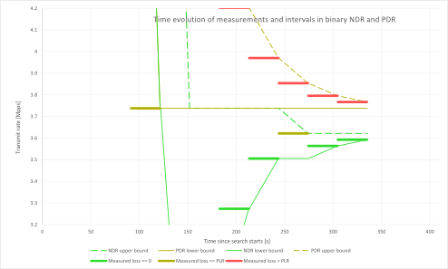

Experimental: MDR Search
========================

Multiple Drop Rate (MDR) Search is a new search algorithm implemented in
FD.io CSIT project. MDR discovers multiple packet throughput rates in a
single search, with each rate associated with a distinct Packet Loss
Ratio (PLR) criteria.

Two throughput measurements used in FD.io CSIT are Non-Drop Rate (NDR,
with zero packet loss, PLR=0) and Partial Drop Rate (PDR, with packet
loss rate not greater than the configured non-zero PLR). MDR search
discovers NDR and PDR in a single pass reducing required execution time
compared to separate binary searches for NDR and PDR. MDR further
reduces execution time, by relying on shorter trial durations of
intermediate steps, but conducting final measurement at the specified
final trial duration. This results in the shorter overall search
execution time when compared to a standard NDR/PDR binary search,
while guaranteeing the same or similar results.

If needed MDR can be easily adopted to discover more throughput rates
with different pre-defined PLRs.

.. Note:: All throughput rates are *always* bi-directional
   aggregates of two equal (symmetric) uni-directional packet rates
   received and reported by an external traffic generator.

Overview
---------

The main properties of MDR search:

- MDR is a duration aware multi-phase multi-rate search algorithm.

  - It starts with a short initial phase to determine promising starting
    bounds for the search.
  - Subsequent intermediate phase(s) progress towards defined final
    search criteria.
  - Final phase executes measurements according to the final search
    criteria.

- Initial phase:

  - Uses link rate as a starting transmit rate and discovers the Maximum
    Receive Rate (MRR) used as an input to subsequent phase.

- Intermediate phase(s):

  - Start with initial trial duration (in the first phase) and converge
    geometrically towards the final trial duration (in the final phase).
  - Track two values for each searched rate (NDR or PDR).

    - The values are called lower_bound and upper_bound.
    - Each value comes from a trial measurement (most recent for that ransmit rate),
      so we can talk about duration and loss of the bound's measurement.
    - A bound can be invalid, for example if NDR lower_bound
      has been measured with nonzero loss.
    - Subsequent phases end with valid bounds.

  - Start with a large (lower_bound, upper_bound) interval width and
    converge (each phase halves the previous width)
    towards the final interval width, that determines measurement resolution.
  - Use internal and external searches:

    - External search - measures at transmit rates outside the (lower_bound,
      upper_bound) interval. Activates when a bound is invalid,
      to search for a new valid bound, while doubling the interval width.
      It is a variant of `exponential search`_.
    - Internal search - `binary search`_, measures at transmit rates within the
      (lower_bound, upper_bound) valid interval, halving the interval width.

- Final phase is executed with a final test trial duration and
  interval width goal.
  Intermediate phases together with the final phase are called subsequent phases.

The main benefits of MDR search vs. binary search include:

- In general MDR is likely to execute more search trials overall, but
  less trials at a set final duration.
- In well behaving cases it greatly reduces (>50%) the overall duration
  compared to a single PDR (or NDR) rate binary search duration.
- In all cases MDR yields the same or similar results to binary search.
- Note: both binary search and MDR are susceptible to reporting
  non-repeatable results across multiple runs for very bad behaving
  cases.

Caveats:

- Worst case MDR can take longer than a binary search e.g. in case of
  drastic changes in behaviour for trials at varying durations.

MDR Search Implementation
-------------------------

Following is a brief description of the current MDR search
implementation in FD.io CSIT.

MDR Input Parameters
````````````````````

#. *maximum_transmit_rate* - maximum packet transmit rate to be used by
   external traffic generator, limited by either the actual Ethernet
   link rate or traffic generator NIC model capabilities. Sample
   defaults: 2 * 14.88 Mpps for 64B 10GE link rate,
   2 * 18.75 Mpps for 64B 40GE NIC maximum rate.
#. *minimum_transmit_rate* - minimum packet transmit rate to be used for
   measurements. MDR search fails if lower transmit rate needs to be
   used to meet search criteria. Default: 2 * 10 kpps (could be higher).
#. *final_trial_duration* - required trial duration for final rate
   measurements. Default: 30 sec.
#. *initial_trial_duration* - trial duration for initial MDR phase.
   Default: 1 sec.
#. *final_relative_width* - required measurement resolution expressed as
   (lower_bound, upper_bound) interval width relative to upper_bound.
   Default: 0.5%.
#. *packet_loss_ratio* - maximum acceptable PLR search criteria for
   PDR measurements. Default: 0.5%.
#. *number_of_intermediate_phases* - number of phases between initial
   phase and final phase. Impacts the overall MDR search duration.
   Less phases are required for well behaving cases, more phases
   may be needed to reduce the overall search duration for worse behaving cases.
   Default (2). Value chosen based on limited experimentation to date.
   More experimentation needed to arrive to clearer guidelines.

Initial phase
`````````````

1. First trial measures at maximum rate and discovers MRR.

   a) in: trial_duration = initial_trial_duration.
   b) in: offered_transmit_rate = maximum_transmit_rate.
   c) do: single trial.
   d) out: measured loss ratio.
   e) out: mrr = measured receive rate.

2. Second trial measures at MRR and discovers MRR2.

   a) in: trial_duration = initial_trial_duration.
   b) in: offered_transmit_rate = MRR.
   c) do: single trial.
   d) out: measured loss ratio.
   e) out: mrr2 = measured receive rate.

3. Third trial measures at MRR2.

   a) in: trial_duration = initial_trial_duration.
   b) in: offered_transmit_rate = MRR2.
   c) do: single trial.
   d) out: measured loss ratio.

Subsequent phases
`````````````````

1. Main loop:

   a) in: trial_duration for the current phase.
      initial_trial_duration for first intermediate phase,
      final_trial_duration for the final phase,
      element of geometric sequence for other intermediate phases.
      For example with two intermediate phases, trial_duration
      of the second intermediate phase is the geometric average
      of initial_strial_duration and final_trial_duration.
   b) in: relative_width_goal for the current phase.
      final_relative_width for the final phase,
      doubling for each preceding subsequent phase.
      For example with two intermediate phases,
      the first intermediate phase uses quadruple of final_relative_width
      and the second intermediate phase uses double of final_relative_width.
   c) in: ndr_interval, pdr_interval from previous loop iteration or previous phase.
      If the previous phase is the initial phase, both intervals have
      lower_bound = MRR2, uper_bound = MRR.
      Note that the initial phase is likely to create intervals with invalid bounds.
   d) do: Prepare new transmit rate to measure with
      (if the phase exit conditions are not met already),
      according to conditions described in point 2.
      If no new rate is prepared, exit the phase by going to g).
   e) do: Perform the trial measurement at the prepared transmit rate
      and trial_duration, and compute its loss ratio.
   f) do: Update bounds of both intervals, based on the new measurement.
      (The actual update rules are numerous, as NDR external search
      can afect PDR interval and vice versa, but the result
      agrees with common sense.)
      Go to next iteration c), taking the updated intervals as new input.
   g) out: the updated ndr_interval and pdr_interval.
      In the final phase this is also considered
      to be the result of the whole search.
      For other phases, the next phase loop is started
      with the current results as an input.

2. Conditions for the new transmit rate (for 1d):

   a) If there is an invalid bound, prepare for external search:

      1) If NDR lower_bound is invalid (the loss was higher than zero),
         the new transmit rate is NDR lower_bound
         decreased by two NDR interval widths.
      2) Else if PDR lower_bound is invalid (the loss was higher than PLR),
         the new transmit rate is PDR lower_bound
         decreased by two PDR interval widths.
      3) Else if NDR upper_bound is invalid (the loss was zero),
         the new transmit rate is NDR upper_bound
         increased by two NDR interval widths.
      4) Else if PDR upper_bound is invalid (the loss was less or equal than PLR),
         the new transmit rate is PDR upper_bound
         increased by two PDR interval widths.

   b) Else if NDR (or PDR) interval does not meet the current phase width goal,
      prepare for internal search. The new transmit rate is
      (lower bound + upper bound) / 2.
      It does not matter which interval is investigated first.
      The current implementation starts with NDR, unless PDR interval si wider.

   c) Else if some bound has still only been measured at a lower duration,
      prepare to re-measure at the current duration (and the same transmit rate).
      The order of priorities is:

      1) NDR lower_bound,
      2) PDR lower_bound,
      3) NDR upper_bound,
      4) PDR upper_bound.

   d) Else do not prepare any new rate, to exit the phase.
      This ensures that at the end of each subsequent phase
      all intervals are valid, narrow enough, and measured
      at current phase trial duration.

Implementation details
----------------------

The algorithm as implemented contains additional details
omitted from the description above.
Here is a short description of them, without detailing their mutual interaction.

1) Logarithmic transmit rate.
   In order to better fit the relative width goal,
   the interval doubling and halving is done differently.
   For example, middle of 2 and 8 is 4, not 5.
2) Optimistic maximum rate.
   The increased rate is never higher than the maximum rate.
   Upper bound at that rate is always considered valid.
3) Pessimistic minimum rate.
   The decreased rate is never lower than the minimum rate.
   If a lower bound at that rate is invalid,
   a phase stops refining the interval further (until it gets re-measured).
4) Conservative interval updates.
   Measurements above current upper bound never update a valid upper bound,
   even if drop ratio is low.
   Measurements below current lower bound always update any lower bound
   if drop ratio is high.
5) Ensure sufficient interval width.
   If the new transmit increased or decreased rate would result in width
   less than the current goal, increase/decrease more.
   This can happen if measurement for the other interval
   makes the current interval too narrow.
   Similarly, take care the measurements in the initial phase
   create wide enough interval.
6) Timeout for bad cases.
   The worst case for MDR search is when each phase converges to intervals
   way different than the results of the previous phase.
   Rather than suffer total search time several times larger
   than pure binary search, the implemented tests fail themselves
   when the search takes too long (given by argument *timeout*).

Test effectiveness comparison
-----------------------------

Introduction
````````````

CSIT release 1804 contains two test suites that use the new MDR search
to enable comparison against existing CSIT NDR and PDR binary searches.
The suites got chosen based on the level of consistency of their
historical NDR/PDR results:

#. 10Ge2P1X520-Ethip4-Ip4Base-Ndrpdr - yielding very consistent binary
   search results.
#. 10Ge2P1X520-Eth-L2Bdbasemaclrn-Eth-2Vhostvr1024-1Vm-Ndrpdr - yielding
   somewhat inconsistent results.

Here "inconsistent" means the values found differ between runs,
even though the setup and the test are exactly the same.

The search part of CSIT binary search tests requires a single 5-second warmup
and each trial measurement is set to 10 seconds.

New tests with MDR search do not have any warmup, as initial measurements
are not critical to the final result. The final trial duration is set 30 seconds.
The final MDR search resolution (a.k.a. width goal) is better/narrower
than in CSIT binary search tests.

Contrary to the merged code described above,
the failrness of the following comparison has been achieved by
setting final relative width to values causing the width to match
the binary NDR/PDR result.
Also, each search algorithm has been run with three different
(final) trial durations: 10s, 30s and 60s.

The table below compares overall test duration between the search tests.
For simplicity only data for single thread 64B packet tests is listed,
as it takes the longest in all cases.
Both Ip4 and Vhost tests are executed as their results are different.

The table is based on result of 6 runs.

Tables
``````

.. table:: Search part of test duration

   ====================  ==========  ===========  ===========  ==========  ===========  ===========
   Duration+-avgdev [s]  IP4 10s     IP4 30s      IP4 60s      Vhost 10s   Vhost 30s    Vhost 60s
   ====================  ==========  ===========  ===========  ==========  ===========  ===========
   MDR (both intervals)  50.8+-1.2   109.0+-10.0  202.8+-11.7  80.5+-9.0   201.9+-20.6  474.9+-58.2
   NDR binary            98.9+-0.1   278.6+-0.1   548.8+-0.1   119.8+-0.1  339.3+-0.1   669.6+-0.2
   PDR binary            98.9+-0.1   278.6+-0.1   548.8+-0.1   119.7+-0.1  339.3+-0.1   669.5+-0.1
   NDR+PDR sum           197.8+-0.1  557.2+-0.2   1097.6+-0.1  239.5+-0.1  678.7+-0.1   1339.2+-0.1
   ====================  ==========  ===========  ===========  ==========  ===========  ===========

.. note:: Here "avgdev" is the estimated difference between
   the average duration computed from the limted sample
   and a true average duration as its hypothetical limit for infinite samples.
   To get the typical difference between one sample duration
   and computed average duration, "avgdev" has to be multiplied
   by the square root of the number of samples.

.. table:: MDR duration as percentage of NDR duration

   ====================================  =========  =========  =========  =========  =========  =========
   Fraction+-uncertainty [%]             IP4 10s    IP4 30s    IP4 60s    Vhost 10s  Vhost 30s  Vhost 60s
   ====================================  =========  =========  =========  =========  =========  =========
   MDR duration divided by NDR duration  51.4+-1.2  39.1+-3.6  37.0+-2.1  67.2+-7.5  59.5+-6.1  70.9+-8.7
   ====================================  =========  =========  =========  =========  =========  =========

Conclusions
```````````

In consistent tests, MDR is on average more than 50% faster
than a single NDR binary search (even when MDR also detects PDR).
One exception is 10 second final trial duration,
probably presence of 2 intermediate phases (instead of just 1) hurts there.
Even in this case MDR is almost 50% faster than NDR binary search.

In inconsistent tests MDR is still somewhat faster than NDR binary search,
but it is not by 50%, and it is hard to quantify as MDR samples have wildly
varying durations.

Graphical examples
------------------

The following graphs were created from the data gathered from comparison runs,
for the vhost tests.
The vertical axis has always the same values,
zoomed into the interesting part of search space.
The faint blue vertical lines separate the phases of MDR search.
The bound lines are sloped just to help locate the previous value,
in reality the bounds are updated instantly at the end of the measurement.

The graphs do not directly show when a particular bound is invalid.
Indirectly, if you see a measurement not satisfying validity conditions
(see point 2a), it means the bound becomes invalid.
Also, the external search follows, and the previously invalid upper or lower
bound becomes a valid lower or upper bound, respectively.

The following three graphs are for MDR with 10 second final trial duration,
showing different behavior in this inconsistent test,
and different amount of "work" done by each phase.
Also the horizontal axis has the same scaling here.





The next graph is for MDR with 60 second final trial duration,
to showcase the final phase takes the most of the overall search time.
The scaling of the horizontal axis is different.



Finally, here are two graphs showing NDR and PDR binary searches.
The horizontal axis has the same scaling as the previous graph,
but the test has 30 second trial duration to make it take similar time.
This shows the binary search spends most time measuring outside
the interesting rate region.



.. _binary search: https://en.wikipedia.org/wiki/Binary_search
.. _exponential search: https://en.wikipedia.org/wiki/Exponential_search
