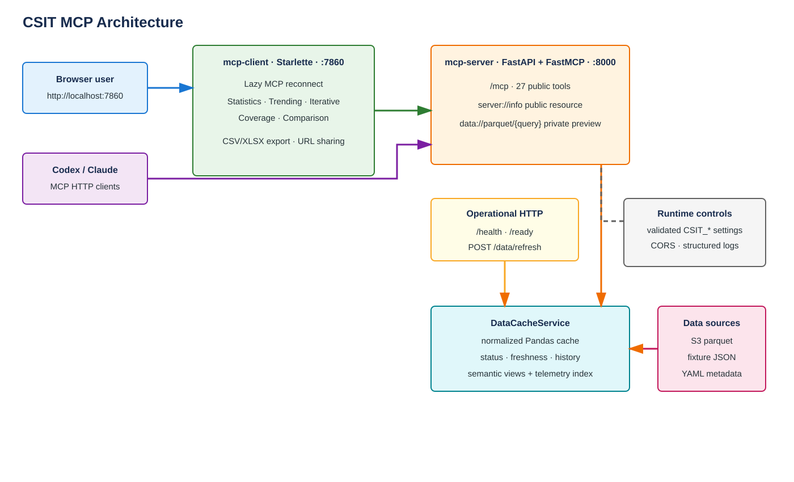
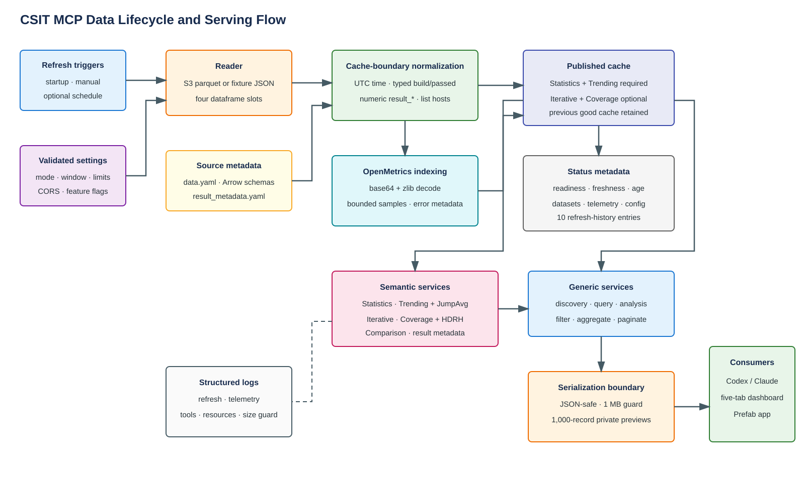

# CSIT MCP

CSIT MCP exposes FD.io CSIT performance data through a FastMCP server and a
browser dashboard. The server loads parquet data from S3-compatible storage or
committed fixtures, normalizes it into an in-memory Pandas cache, and provides
discovery, query, analysis, telemetry, and dashboard-oriented tools. The
Starlette client turns those tools into a five-tab dashboard without a frontend
build system.

The stack targets Python 3.13 and uses locked `uv` environments.

## Architecture



The project runs as two services:

| Service | Port | Responsibility |
| --- | ---: | --- |
| `mcp-server` | `8000` | FastAPI wrapper, FastMCP endpoint at `/mcp`, operational routes, data lifecycle, semantic services, and MCP tools/resources. |
| `mcp-client` | `7860` | Resilient MCP client and server-rendered CSIT Dashboard. |

Codex, Claude, and other MCP clients connect directly to
`http://localhost:8000/mcp`. Browser users open `http://localhost:7860`; the
client then calls the same public MCP tools.

The server keeps HTTP liveness independent from data readiness. Importing the
application does not read S3. FastMCP lifespan starts a background refresh, so
`/health` can respond while data is loading and `/ready` reports whether the
cache can serve queries. With the configured snapshot path, S3 refreshes are
built in a disposable process and published only after a complete generation
has been validated.

## MCP Surface

The server currently publishes 29 read-only tools, one public resource, and one
private/internal resource. `server://info` reports the tool list, capability
counts, resource visibility, and current cache status.

| Kind | Name | Purpose |
| --- | --- | --- |
| Discovery | `datasets` | Dataset status, row counts, configured partitions, and telemetry availability. |
| Discovery | `columns` | Configured/cached columns, dtypes, counts, and result metadata. |
| Discovery | `values` | Common scalar or list-valued dimension values. |
| Discovery | `schema` | Configured `data.yaml` schema and result-column metadata. |
| Generic analysis | `compare_hosts` | Direction-aware host comparison for one result column. |
| Generic analysis | `trend_summary` | Recent-versus-baseline trend summary. |
| Generic analysis | `find_regressions` | Grouped deterministic regression detection. |
| Generic analysis | `find_anomalies` | Explainable anomaly scores. |
| Generic analysis | `top_failures` | Ranked failure counts. |
| Telemetry | `telemetry_metrics` | Filtered OpenMetrics samples. |
| Telemetry | `telemetry_metric_values` | Grouped telemetry summaries. |
| Telemetry | `telemetry_trend_summary` | Recent-versus-baseline telemetry trends. |
| Telemetry | `telemetry_anomalies` | Telemetry anomaly summaries. |
| Telemetry | `telemetry_catalog` | Lightweight discovery of telemetry-capable Trending series without JumpAvg or decoding. |
| Telemetry | `telemetry_timeseries` | Authoritative, bounded time-series decoding for selected Trending series, nodes, and time windows. |
| Statistics | `job_statistics` | Run duration plus joined pass/fail and run metadata. |
| Trending | `trending_catalog` | Cascading filter options and logical series definitions. |
| Trending | `trending_series` | Passed-only semantic samples with JumpAvg trend analysis. |
| Generic data | `trending` | Filtered, sorted, projected, paginated raw trending rows. |
| Iterative | `iterative_catalog` | Cascading release/test filters and logical series definitions. |
| Iterative | `iterative_series` | Passed-only semantic samples for box plots. |
| Generic data | `iterative` | Filtered, sorted, projected, paginated raw iterative rows. |
| Coverage | `coverage_catalog` | Cascading Coverage filter options. |
| Coverage | `coverage_tables` | Passed-only grouped Coverage rows and decoded latency percentiles. |
| Generic data | `coverage` | Filtered, sorted, projected, paginated raw coverage rows. |
| Comparison | `comparison_catalog` | Reference and meaningful comparison choices from Iterative data. |
| Comparison | `comparison_table` | Passed-sample statistical comparison summaries. |
| Comparison | `comparison_data` | Matching passed and failed source rows for export. |
| UI | `dashboard` | Legacy Prefab statistics dashboard output for MCP app clients. |

### Generic Data Contracts

`trending`, `iterative`, and `coverage` accept exact-match filters for
`test_type`, `dut_type`, `job`, `release`, `hosts`, `test_id`, and
`build`, plus `passed`, `columns`, sorting, `offset`, `limit`, and
aggregations `none`, `hosts`, `test_id`, or `hosts_by_test_id`. Unsupported
columns produce a field-level `validation_error` instead of being ignored.

Successful paginated responses include `row_count`, `returned_count`,
`has_more`, and `next_offset`. Compact dashboard-oriented tools use the same
availability, validation, pagination, payload-size, freshness, and data-status
conventions.

### Resources

| Visibility | URI | Behavior |
| --- | --- | --- |
| Public | `server://info` | Server metadata, 29-tool capability list, telemetry/query limits, public/private resource arrays, and cache status. |
| Private/internal | `data://parquet/{query}` | JSON preview of one cached dataset or `all`; capped at 1,000 records per dataset and subject to the response-size guard. |

Prefer public tools for user and AI-client queries. The parquet resource is a
bounded diagnostic preview, not an export API.

### Payload Safety

Serialized MCP responses are limited to 1,000,000 bytes. An oversized response
is replaced with `response_too_large`, including estimated size and suggestions
to reduce `limit`, use `offset`, request fewer columns, filter dimensions, or
aggregate. This applies at the MCP serialization boundary and never logs the
discarded records.

## Data



Four cached dataframes form the source model:

| Dataset | Required for readiness | Main use |
| --- | --- | --- |
| `statistics` | Yes | Run start time and duration. |
| `trending` | Yes | Time-series results and pass/fail data; raw telemetry is detached into a private sidecar. |
| `iterative` | No | Release-oriented samples and Comparison source data. |
| `coverage` | No | NDR/PDR throughput and HDR Histogram latency coverage. |

`dashboard/data/data.yaml` declares S3 paths, partitions, schemas, releases, and
columns. Fixture mode reads one JSON file per dataset from
`dashboard/data/fixtures/` and needs no AWS credentials.

### Data Loading Lifecycle

1. FastMCP lifespan restores the last local cache snapshot when configured,
   starts an immediate background refresh, and yields. A sufficiently fresh
   snapshot can suppress that immediate remote refresh.
2. `DataCacheService` validates configuration before creating a reader.
3. Fixture mode loads in-process. S3 mode with snapshots builds the replacement
   generation in a disposable process; a timeout or worker failure leaves the
   serving generation untouched.
4. Cache-boundary normalization preserves compact Arrow-backed UTC timestamps,
   strings, and host lists while normalizing builds, booleans, and numeric
   `result_*` columns.
5. Raw telemetry is removed from public result frames. A compact indexed
   source-row locator is built for targeted queries, and encoded blobs remain
   in a private sidecar.
6. Required data is published, making readiness available while optional
   Iterative and Coverage reads and bounded telemetry indexing continue.
7. Snapshot format v2 persists result frames, telemetry sidecars, and locators
   separately with Arrow-native schemas, checksums, round-trip validation, and
   a retained previous generation. Manifests record generation IDs, row counts,
   file hashes, and schema hashes.
8. OpenMetrics is decoded into a bounded sampled index for discovery and
   diagnostics.
9. Generation-aware semantic and telemetry query caches are released when the
   canonical cache changes. Repeated dimensions and trend classifications use
   compact categorical storage when it saves memory.
10. Status becomes `ready`, `degraded`, or `failed`. A failed refresh preserves
   the previous successful cache or restored snapshot.

An initial load reports `loading` until required data is published, then may
report serving-ready `degraded` while optional data finishes. Later refreshes
keep the previous successful generation serving, so readiness does not flap.

Startup, manual, and optional scheduled refreshes are identified as `startup`,
`manual`, or `scheduled`. Concurrent refreshes are rejected. Status snapshots
include timestamps, cache age, load duration, row counts, per-dataset metadata,
telemetry status, normalized configuration, the last refresh source, and up to
10 completed refresh attempts. The additive `memory` block reports cgroup
usage, canonical cache components, and retained derived/query-cache estimates.
Refresh admission rejects a replacement build when projected usage exceeds the
configured memory threshold.

### Semantic Views

The raw cache remains compatible with generic data tools. Focused services
derive bounded semantic views for the dashboard:

- Trending and Iterative parse CSIT test identifiers, create host-independent
  logical series, and split NDR/PDR rows into separate series.
- Trending uses only passed rows and applies `jumpavg.classify()` independently
  per series, metric, and unit. Throughput/bandwidth are higher-is-better;
  latency is lower-is-better.
- Iterative uses passed finite samples and client-side Tukey 1.5-IQR box
  summaries.
- Coverage uses passed rows, converts rates to MPPS and bandwidth to Gbps, and
  decodes forward/reverse HDR Histograms into P50/P90/P99 microseconds.
- Comparison uses Iterative data. Summaries use passed finite samples; raw
  export data retains matching passed and failed rows. Optional outlier removal
  applies Tukey fences independently to reference and compared groups.

Static `result_metadata.yaml` adds display names, unit or unit-column hints,
scale, preferred direction, descriptions, and comparable dimensions such as
hosts, test ID, build, release, job, DUT/TG attributes, pass state, and time.

### Telemetry

Telemetry arrives embedded in result rows, but cache publication detaches it
from the public dataframes into a private raw sidecar. Generic data tools and
the private parquet preview never return raw telemetry.
The cache decodes base64 plus zlib OpenMetrics text and parses samples, labels,
optional timestamps, `HELP`, `TYPE`, and `UNIT` metadata. The parser accepts
standard double-quoted labels plus the unquoted and single-quoted dialects
found in CSIT telemetry, publishing one canonical label representation.
Invalid cells are reported in telemetry status without failing result-data
readiness.

The long-form discovery index is bounded by
`CSIT_TELEMETRY_MAX_SOURCE_ROWS` and `CSIT_TELEMETRY_MAX_SAMPLES`; it is not an
authoritative historical sample. Its tool responses include an `index` block
with representative scope, indexed/total source-row counts, sample count, and
truncation state. Use `telemetry_timeseries` for analysis. It
uses the compact locator to filter source rows by selected Trending series,
testbed, time window, and pass state before reading or decoding raw blobs. It
supports multiple VPP node names in one call and reports completeness
with source-metric, node-selection, and semantic-policy stage counts. The semantic
`cycles_per_packet` metric prefers
`vpp.inst_and_clock.clocks_per_packets` and falls back to per-node
`vpp.runtime.clocks`, using active runtime samples and treating lower values as
better. Per-thread samples retain their thread identity instead of being
silently collapsed.

Telemetry work shares a configurable concurrency gate. Large generic queries
also pass through a process-wide admission controller that checks concurrency
and cgroup memory pressure. Broad legacy telemetry
calls are serialized by default, repeated completed time-series requests use a
generation-aware entry- and byte-bounded cache, and encoded/decoded byte limits
bound decompression. Selected cells are decoded and parsed in a disposable
worker process with a deadline and Linux address-space limit. Over-budget work
returns `server_busy`, `query_timeout`,
or `query_too_large` instead of a partial result. The browser
dashboard currently has no separate telemetry tab.

## Configuration

### Server Environment

| Variable | Code default | Base Compose | Validation and behavior |
| --- | --- | --- | --- |
| `CSIT_DATA_MODE` | `s3` | inherited | `s3` or `fixture`. |
| `CSIT_TIME_PERIOD` | `200` | `100` | Positive integer; S3/fixture time filtering applies to Statistics and Trending and is capped at 200 days. |
| `CSIT_REFRESH_INTERVAL_SECONDS` | `0` | inherited | Integer; positive enables scheduled refresh, zero or negative disables it. |
| `CSIT_CORS_ALLOW_ORIGINS` | `*` | inherited | `*` alone or comma-separated `http://`/`https://` origins. |
| `CSIT_MAX_POOL_SIZE` | `30` | inherited | Positive integer for S3 client pooling. |
| `CSIT_TELEMETRY_MAX_SOURCE_ROWS` | `500` | inherited | Positive per-dataset source-row indexing cap. |
| `CSIT_TELEMETRY_MAX_SAMPLES` | `100000` | inherited | Positive per-dataset metric-sample cap. |
| `CSIT_TELEMETRY_QUERY_MAX_CONCURRENT` | `1` | `1` | Maximum simultaneous raw or targeted telemetry computations. |
| `CSIT_TELEMETRY_QUERY_QUEUE_TIMEOUT_SECONDS` | `5` | `5` | Wait before returning `server_busy`. |
| `CSIT_TELEMETRY_QUERY_TIMEOUT_SECONDS` | `30` | `30` | Targeted-query processing deadline. |
| `CSIT_TELEMETRY_QUERY_MAX_SOURCE_ROWS` | `2000` | `2000` | Maximum source rows decoded by one targeted request. |
| `CSIT_TELEMETRY_QUERY_MAX_SAMPLES` | `20000` | `20000` | Maximum compact points built by one targeted request. |
| `CSIT_TELEMETRY_QUERY_CACHE_ENTRIES` | `256` | inherited | Bounded decoded-row and response cache size. |
| `CSIT_TELEMETRY_QUERY_MAX_ENCODED_BYTES` | `134217728` | `134217728` | Maximum encoded telemetry bytes selected by one targeted request. |
| `CSIT_TELEMETRY_QUERY_MAX_DECODED_BYTES` | `536870912` | `536870912` | Maximum decompressed OpenMetrics bytes processed by one request. |
| `CSIT_TELEMETRY_WORKER_MEMORY_LIMIT_BYTES` | `2147483648` | `2147483648` | Linux address-space limit for each isolated telemetry decode worker. |
| `CSIT_QUERY_MAX_CONCURRENT` | `1` | `1` | Maximum overlapping large dataframe/telemetry queries. |
| `CSIT_QUERY_QUEUE_TIMEOUT_SECONDS` | `5` | `5` | Admission wait before returning `server_busy`. |
| `CSIT_QUERY_HEAVY_ROW_THRESHOLD` | `100000` | `100000` | Dataset size at which shared admission control applies. |
| `CSIT_QUERY_MEMORY_SOFT_LIMIT_PERCENT` | `75` | `75` | Reject new heavy work at or above this cgroup-memory percentage. |
| `CSIT_CACHE_SNAPSHOT_PATH` | empty | `/home/csit-mcp/cache/data` | Atomic Arrow-native generation snapshot with private telemetry sidecars and last-known-good fallback. |
| `CSIT_REFRESH_MEMORY_LIMIT_PERCENT` | `85` | inherited | Reject a replacement refresh when projected cgroup use exceeds this percentage. |
| `CSIT_SNAPSHOT_REFRESH_MAX_AGE_SECONDS` | `0` | inherited | Positive age allows a fresh restored snapshot to skip the immediate S3 refresh; zero disables the optimization. |
| `CSIT_REFRESH_WORKER_TIMEOUT_SECONDS` | `1800` | inherited | Deadline for the disposable S3 generation-build process. |
| `CSIT_S3_READ_MAX_ATTEMPTS` | `3` | inherited | Positive number of bounded application-level S3 read attempts; botocore adaptive retries also apply. |
| `CSIT_S3_READ_RETRY_BASE_SECONDS` | `2` | inherited | Positive base delay for exponential application-level S3 read retries. |
| `CSIT_START_TRENDING` | `true` | `True` | Validated boolean-compatible flag. |
| `CSIT_START_STATISTICS` | `true` | `True` | Validated boolean-compatible flag. |
| `CSIT_START_REPORT` | `true` | `False` | Controls whether missing Iterative data degrades readiness. |
| `CSIT_START_COVERAGE` | `true` | `True` | Controls whether missing Coverage data degrades readiness. |
| `CSIT_START_FAILURES` | `true` | `True` | Validated compatibility flag. |
| `CSIT_AWS_ENDPOINT_URL` | empty | inherited | Optional S3-compatible endpoint override. |

Accepted booleans are `true/yes/y/1` and `false/no/n/0`, case-insensitive.
Invalid documented settings do not prevent process import: they are logged,
loading fails before reader construction, and `/ready` returns `503` with
`data.configuration.valid=false` and field-level errors. Restart after fixing
the environment; settings are resolved once at startup.

### Client Environment

| Variable | Default | Meaning |
| --- | --- | --- |
| `MCP_SERVER_URL` | `http://mcp-server:8000` | MCP server base URL. |
| `MCP_PATH` | `/mcp` | MCP HTTP path appended to the base URL. |

### Common Scenarios

No-AWS local data:

```sh
docker compose -f docker-compose.yaml -f docker-compose.fixture.yaml up --build
```

For Compose-specific overrides, add a local override such as:

```yaml
services:
  mcp-server:
    environment:
      CSIT_REFRESH_INTERVAL_SECONDS: "3600"
      CSIT_CORS_ALLOW_ORIGINS: "http://localhost:7860,https://dashboard.example.org"
```

Then include it after the base file:

```sh
docker compose -f docker-compose.yaml -f docker-compose.local.yaml up --build
```

## Server

The FastAPI wrapper in `mcp-server/server.py` applies CORS and mounts the
FastMCP HTTP app assembled by `dashboard/__init__.py`.

| HTTP route | Semantics |
| --- | --- |
| `GET /health` | Process liveness; always `200` with `mcp-server` identity. |
| `GET /ready` | `200` for ready/degraded-but-servable cache, otherwise `503`; includes the full data snapshot. |
| `POST /data/refresh` | Starts a manual background refresh (`202`) or reports one already running (`409`). |
| `/mcp` | Streamable HTTP MCP endpoint. |

Important server boundaries:

| Area | Module |
| --- | --- |
| Settings and validation | `dashboard/settings.py` |
| Cache and refresh history | `dashboard/services/data_cache.py` |
| Refresh process isolation | `dashboard/services/refresh_worker.py` |
| Derived-index ownership | `dashboard/services/index_registry.py` |
| Memory accounting | `dashboard/services/memory.py` |
| Lifespan/scheduling | `dashboard/services/lifecycle.py` |
| Discovery/query/serialization | `dashboard/services/discovery.py`, `query.py`, `serialization.py` |
| Generic analysis | `dashboard/services/analysis.py`, `analysis_statistics.py` |
| Semantic result parsing | `dashboard/services/result_series.py` |
| Statistics/Trending/Iterative/Coverage/Comparison | matching modules under `dashboard/services/` |
| OpenMetrics parsing and sampled index | `dashboard/services/telemetry.py` |
| Authoritative bounded telemetry queries | `dashboard/services/telemetry_query.py` |
| Isolated telemetry decode worker | `dashboard/services/telemetry_worker.py` |
| MCP registration | `dashboard/mcp_tools.py` |

Operational events are emitted as JSON message strings through Python logging.
Events cover refreshes and isolated generation workers, snapshots,
required-first cache publication, telemetry workers/indexing,
bounded query starts/rejections/completions, MCP tool/resource completion, and
oversized responses. Query events include concurrency, duration, and
best-effort process RSS, but never dataframe records, credentials, or bodies.

## Client

The client is a Starlette application with external CSS and small vanilla
JavaScript assets. It has no frontend build step. `MCPClientState` attempts an
initial connection but does not fail startup when the server is unavailable.
It reconnects lazily under a shared lock, retains last successful MCP metadata,
and closes the active context on shutdown.

| Route | Purpose |
| --- | --- |
| `GET /` | Render the selected dashboard tab and query-param state. |
| `GET /health` | Client liveness (`200`) plus nested MCP dependency state. |
| `GET /api/statistics/run-details` | Fetch paginated failed tests for one job/build. |
| `GET /api/statistics/export` | Statistics CSV/XLSX snapshot. |
| `GET /api/trending/export` | Complete selected-series Trending export. |
| `GET /api/iterative/export` | Complete selected-series Iterative export. |
| `GET /api/coverage/export` | Complete filtered Coverage export. |
| `GET /api/comparison/export` | Comparison summary or raw-data export. |

The dashboard tabs are:

| Tab | Presentation |
| --- | --- |
| Statistics | Cascading DUT/test type/cadence/testbed filters, passed/failed and duration bar charts, keyboard-accessible run details, canonical failed-test names, export, and URL copy. |
| Trending | Cascading catalog, URL-persisted logical series, passed-only throughput/bandwidth/latency scatter plots, JumpAvg trend lines and anomalies, details dialog, export, and URL copy. |
| Iterative | Release-aware catalog, selected series, passed-only Tukey box plots with samples/outliers, details dialog, export, and URL copy. |
| Coverage | No-default cascade, responsive accordion tables, sortable columns, decoded latency percentiles, external result links, export, and URL copy. |
| Comparison | Iterative-backed reference/compared cascade, optional extreme-outlier removal, summary table filtering/sorting, summary/raw exports, and URL copy. |

MCP JSON errors render inline where possible. Connection failures and thrown
required-tool failures produce a readable HTTP `503` status page. CSV exports
are UTF-8; XLSX exports use Excel Tables with filters, sortable headers, frozen
header rows, and readable widths.

## Running With Docker Compose

Create the external network once, then start the S3-backed stack:

```sh
docker network create mcp
docker compose up --build
```

For fixture mode without AWS credentials:

```sh
docker compose -f docker-compose.yaml -f docker-compose.fixture.yaml up --build
```

Open:

- Dashboard: http://localhost:7860
- Client health: http://localhost:7860/health
- Server liveness: http://localhost:8000/health
- Server readiness: http://localhost:8000/ready
- MCP endpoint: http://localhost:8000/mcp

Stop the stack with `docker compose down`.

Compose runs both containers as `${UID}:${GID}`. If those variables are not
exported by your shell:

```sh
env UID=$(id -u) GID=$(id -g) docker compose up --build
```

Both images install locked dependencies before copying source and run with
`uv run --no-sync`. `HOME=/home/csit-mcp` and
`UV_CACHE_DIR=/tmp/uv-runtime-cache` are writable for the host identity. S3 mode
mounts `${HOME}/.aws` read-only at `/home/csit-mcp/.aws`; fixture mode needs no
AWS credentials. The server Compose health check uses `/ready`, while the
client starts when the server process starts and reconnects while data loads.

## Integration With Codex

Connect an MCP client to:

```text
http://localhost:8000/mcp
```

Example Codex CLI registration:

```sh
codex mcp add csit_mcp --url http://localhost:8000/mcp
codex mcp list
```

For Claude Code, use its HTTP MCP registration command for the same URL. Claude
Desktop configuration depends on the installed version and whether it supports
remote HTTP MCP servers directly; see the engineer guide at
[`doc/code/integration.md`](doc/code/integration.md) for verified boundaries.

Use a discovery-first workflow:

1. Read `server://info` or call `datasets()`.
2. Inspect `columns(dataset)` and `values(dataset, column)`.
3. Choose a generic query, a compact analysis tool, or a dashboard-oriented
   catalog/series tool.
4. Keep raw queries narrow with filters, selected columns, aggregation, and a
   small limit.
5. Follow `has_more` and `next_offset` only when more records are necessary.

For historical telemetry, resolve telemetry-capable series with
`telemetry_catalog`, then
make one `telemetry_timeseries` request containing all required series and VPP
node names. Do not fan out concurrent raw `telemetry_metrics` calls. Check
`completeness.complete` before interpreting the result.

## Usage Examples

Operational checks:

```sh
curl http://localhost:8000/health
curl http://localhost:8000/ready
curl -X POST http://localhost:8000/data/refresh
curl http://localhost:7860/health
```

Useful AI-client prompts:

```text
Use csit_mcp to list datasets, then show the columns and result metadata for iterative.
Use csit_mcp values to discover common trending jobs and test types before querying rows.
Fetch 20 passed trending rows for a selected job with only job, build, hosts, test_id, and the receive-rate result.
List the logical Trending series for VPP IPv4 MRR tests, then fetch the selected series and explain its JumpAvg regressions.
List Iterative series for the newest release and compare their throughput distributions.
Show Coverage options, select one complete filter path, and summarize NDR/PDR rates and P50/P90/P99 latency.
Build a DUT-version comparison from Iterative data and explain relative mean and propagated stdev.
Use telemetry_catalog to resolve the selected Trending series, then fetch cycles_per_packet for p4-lookup and ip6-lookup over the available window with one telemetry_timeseries call; analyze only if completeness.complete is true.
Check server readiness and configuration errors before diagnosing a data_unavailable response.
Explain a response_too_large error and propose narrower filters or aggregation.
```

Browser examples:

- Open `/?dataset=statistics` for run history.
- Open `/?dataset=trending` and add one or more logical series.
- Open `/?dataset=iterative` for release-oriented box plots.
- Open `/?dataset=coverage` and complete the five-step filter cascade.
- Open `/?dataset=comparison` to compare Iterative dimensions.

The `Show URL` actions preserve the current selection for sharing. Download
dialogs default to XLSX and also support CSV.

## Development

Install and test each service from its own directory:

```sh
cd mcp-server
uv sync --locked
uv run --locked python -m unittest discover
uv run --locked python -c "import server; assert server.app"
uv run --locked python scripts/memory_benchmark.py --mode fixture --days 60

cd ../mcp-client
uv sync --locked
uv run --locked python -m unittest discover
```

Useful repository checks:

```sh
docker compose config
docker compose -f docker-compose.yaml -f docker-compose.fixture.yaml config
xmllint --noout doc/diagrams/*.drawio doc/diagrams/*.svg \
  doc/code/diagrams/*.drawio doc/code/diagrams/*.svg
git diff --check
```

Server tests cover settings, lifecycle/cache behavior, discovery, generic
queries, serialization and payload guards, telemetry, analysis, semantic
Statistics/Trending/Iterative/Coverage/Comparison services, MCP registration,
and the legacy dashboard builder. Client tests cover resilience, all five
dashboard renderers, pagination, interactions, exports, and error handling.

The detailed engineer guide starts at [`doc/code/README.md`](doc/code/README.md).

## Repository Map

```text
.
|-- README.md
|-- docker-compose.yaml
|-- docker-compose.fixture.yaml
|-- doc/
|   |-- code/                  # Engineer-facing source guide and diagrams
|   |-- diagrams/              # README architecture and data-flow diagrams
|   |-- improvements/          # Historical and future-looking roadmaps
|   `-- tasks/                 # Task specifications
|-- mcp-server/
|   |-- server.py              # FastAPI wrapper
|   |-- dashboard/
|   |   |-- __init__.py        # FastMCP assembly
|   |   |-- mcp_tools.py       # 29 public tools and two resources
|   |   |-- routes.py          # Health/readiness/refresh routes
|   |   |-- settings.py        # Validated runtime settings
|   |   |-- data/              # S3 reader, fixtures, schemas, metadata
|   |   |-- services/          # Cache, query, telemetry, analysis, semantics
|   |   `-- ui/                # Legacy Prefab dashboard builder
|   |-- scripts/               # Repeatable memory benchmark
|   `-- tests/
`-- mcp-client/
    |-- app.py                  # MCP state, orchestration, HTTP routes
    |-- dashboard.py            # Shared shell and Statistics rendering
    |-- *_dashboard.py          # Trending/Iterative/Coverage/Comparison views
    |-- *_export.py             # CSV/XLSX builders
    |-- templates/              # Standard-library HTML templates
    |-- static/                 # CSS and vanilla JavaScript
    `-- tests/
```

## Notes

- README describes implemented behavior only. Roadmap files under
  `doc/improvements/` are not runtime documentation.
- `fixture` mode is deterministic development data, not a production source.
- The cache is in-memory and refresh history resets when the process restarts.
- S3 refresh construction is process-isolated when
  `CSIT_CACHE_SNAPSHOT_PATH` is configured; fixture and injected-reader loads
  remain in-process.
- Statistics and Trending are required for readiness; Iterative and Coverage
  are optional datasets whose enabled empty state can degrade readiness.
- Public MCP responses are JSON strings at the protocol boundary. Internal
  services generally return dictionaries or dataframes.
- The browser dashboard is server-rendered and URL-driven. It does not maintain
  a server session or browser-local saved views.
- Export generation is request-time and does not persist files on the server.
- Editable diagrams and matching SVG exports are versioned together.
