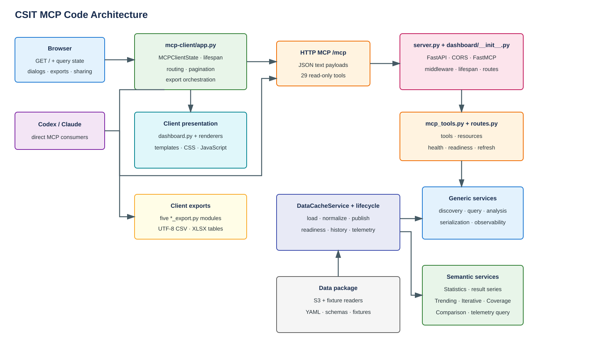
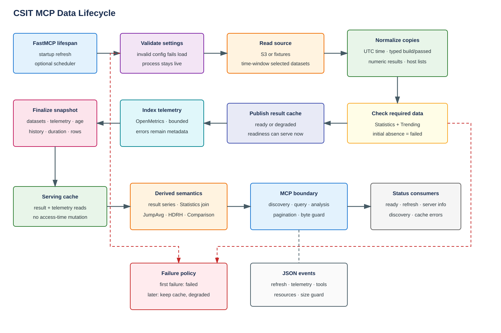
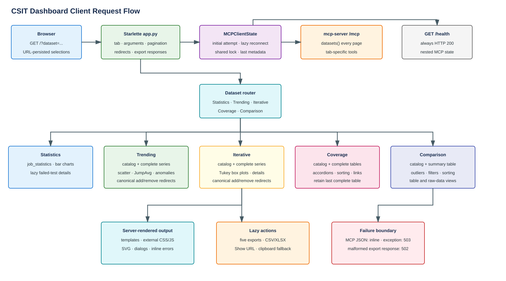

# Architecture

## Service Boundaries

| Component | Responsibility |
| --- | --- |
| Browser | Selects URL-driven dashboard state, submits filters, opens details dialogs, downloads files, and copies share URLs. |
| `mcp-client` | Owns MCP connection state, orchestrates dashboard-specific tool calls, renders HTML/SVG, and generates CSV/XLSX responses. |
| `mcp-server` | Validates settings, loads and normalizes data, derives semantic views, runs analysis, serializes guarded MCP responses, and exposes operational routes. |
| S3 or fixtures | Supplies the four source datasets. |

Codex and Claude bypass the browser client and call the server MCP endpoint
directly. The browser client does not proxy arbitrary MCP requests; it calls a
fixed set of public tools required by each tab.

The FastAPI wrapper is in [`server.py`](../../mcp-server/server.py). FastMCP
assembly is in [`dashboard/__init__.py`](../../mcp-server/dashboard/__init__.py).
The server is importable without loading data because startup refresh belongs
to the FastMCP lifespan.

## Server Modules

| Module | Responsibility |
| --- | --- |
| [`settings.py`](../../mcp-server/dashboard/settings.py) | Parse and validate documented `CSIT_*` settings. |
| [`data_cache.py`](../../mcp-server/dashboard/services/data_cache.py) | Refresh state machine, cache publication, normalization, telemetry indexing, readiness, and history. |
| [`lifecycle.py`](../../mcp-server/dashboard/services/lifecycle.py) | Startup refresh, scheduled loop, and shutdown cancellation. |
| [`discovery.py`](../../mcp-server/dashboard/services/discovery.py) | Dataset, column, value, schema, result-metadata, and telemetry discovery. |
| [`query.py`](../../mcp-server/dashboard/services/query.py) | Generic filters, aggregation, sorting, projection, and pagination. |
| [`serialization.py`](../../mcp-server/dashboard/services/serialization.py) | JSON-safe values, resource previews, pagination envelopes, and byte limits. |
| [`analysis.py`](../../mcp-server/dashboard/services/analysis.py) | Compact generic comparison, trend, regression, anomaly, and failure payloads. |
| [`telemetry.py`](../../mcp-server/dashboard/services/telemetry.py) | OpenMetrics decode, parse, index, query, summary, trend, and anomaly logic. |
| [`result_series.py`](../../mcp-server/dashboard/services/result_series.py) | Shared CSIT test-ID parsing and semantic result mapping. |
| [`statistics.py`](../../mcp-server/dashboard/services/statistics.py) | Job dimensions and Statistics/Trending run joins. |
| [`trending.py`](../../mcp-server/dashboard/services/trending.py) | Passed-only logical Trending catalog and series points. |
| [`trending_analysis.py`](../../mcp-server/dashboard/services/trending_analysis.py) | JumpAvg groups, trend values, stdev, and direction-aware classifications. |
| [`iterative.py`](../../mcp-server/dashboard/services/iterative.py) | Release-aware passed-only Iterative catalog and series points. |
| [`coverage.py`](../../mcp-server/dashboard/services/coverage.py) | Passed-only Coverage tables, conversions, result URLs, and HDR decoding. |
| [`comparison.py`](../../mcp-server/dashboard/services/comparison.py) | Iterative-backed candidate discovery, summary statistics, and raw comparison rows. |
| [`mcp_tools.py`](../../mcp-server/dashboard/mcp_tools.py) | Registers 27 public tools and two resources and applies MCP boundary logging. |

## Client Modules

| Module | Responsibility |
| --- | --- |
| [`app.py`](../../mcp-client/app.py) | `MCPClientState`, lifespan, HTTP routes, MCP orchestration, pagination, redirects, and export responses. |
| [`dashboard.py`](../../mcp-client/dashboard.py) | Shared page shell, status panel, tabs, Statistics charts/dialogs/actions. |
| [`trending_dashboard.py`](../../mcp-client/trending_dashboard.py) | Catalog filters, selected series, scatter/trend/anomaly SVGs, details, and actions. |
| [`iterative_dashboard.py`](../../mcp-client/iterative_dashboard.py) | Catalog filters, selected series, Tukey box plots, details, and actions. |
| [`coverage_dashboard.py`](../../mcp-client/coverage_dashboard.py) | Cascading filters, accordions, grouped headers, links, and actions. |
| [`comparison_dashboard.py`](../../mcp-client/comparison_dashboard.py) | Reference/compared controls, summary table, client-side filters, and actions. |
| `*_export.py` | Normalize rows and generate UTF-8 CSV or XLSX Excel Tables. |
| [`templates/`](../../mcp-client/templates/) | `string.Template` HTML fragments and page/status shells. |
| [`static/`](../../mcp-client/static/) | Responsive CSS and dependency-free JavaScript. |

## Data Lifecycle

1. Lifespan calls `start_refresh(started_by="startup")` and yields.
2. The reader loads S3 parquet or fixture JSON.
3. `DataCacheService` copies and normalizes all configured dataframes.
4. Required Statistics and Trending data is published.
5. Telemetry is decoded and indexed without blocking result readiness.
6. Status metadata and refresh history are exposed through `/ready`,
   `server://info`, discovery tools, and cache errors.
7. Later failures retain the previous successful cache.

## Browser Request Flow

Every page render calls `datasets()` for status. Additional calls depend on the
selected tab:

| Tab | Required MCP calls |
| --- | --- |
| Statistics | `job_statistics`; failed tests are fetched lazily through paginated `trending` calls. |
| Trending | `trending_catalog`; selected IDs trigger complete pagination of `trending_series`. |
| Iterative | `iterative_catalog`; selected IDs trigger complete pagination of `iterative_series`. |
| Coverage | `coverage_catalog`; a complete filter selection triggers complete pagination of `coverage_tables`. |
| Comparison | `comparison_catalog`; a complete selection triggers complete pagination of `comparison_table`. |

Add/remove actions for Trending and Iterative use HTTP `303` redirects to
canonical URLs. Coverage and Comparison state is represented by query
parameters. Details for Trending/Iterative use data already rendered into SVG;
only Statistics details issue a later MCP query.

Export endpoints re-query complete data rather than exporting the rendered
page. They validate pagination and return `400`, `502`, or `503` for client
input, malformed upstream data, or MCP availability failures respectively.

## External Dependencies

- S3-compatible object storage and AWS credentials in default mode.
- FD.io result links generated by Coverage point to
  `https://logs.fd.io/vex-yul-rot-jenkins-1/`.
- MCP consumers such as Codex or Claude.
- No database, queue, persistent cache, frontend package manager, or CI
  configuration is present in this repository.
