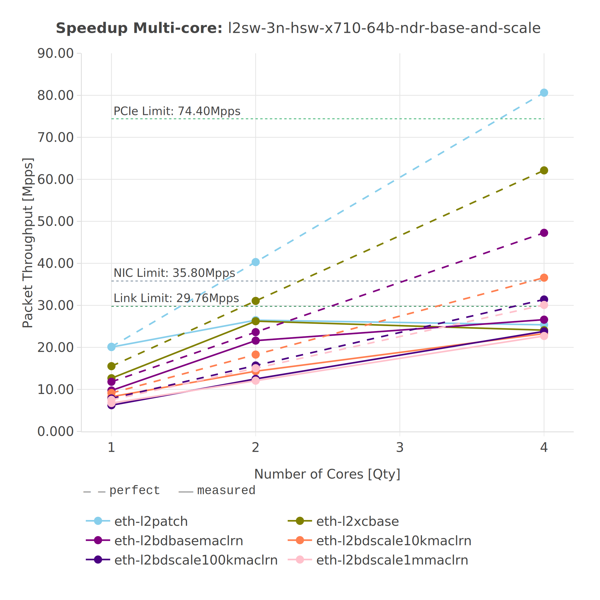
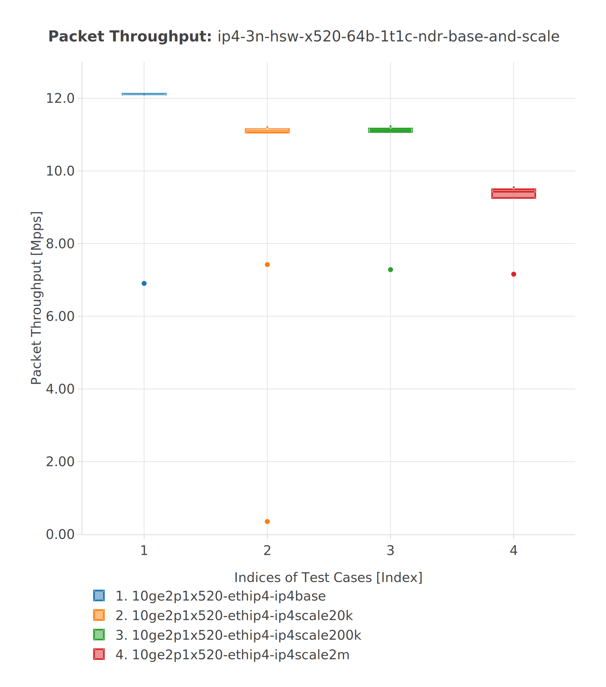
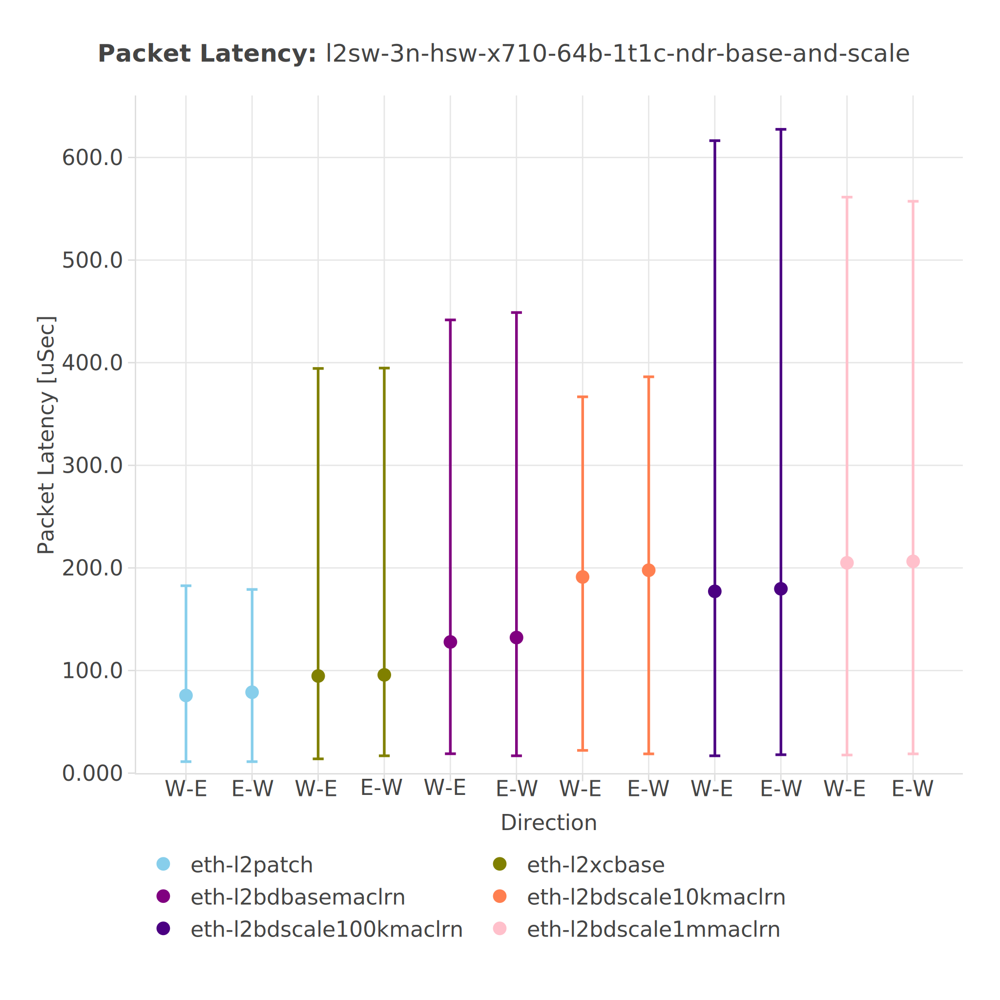
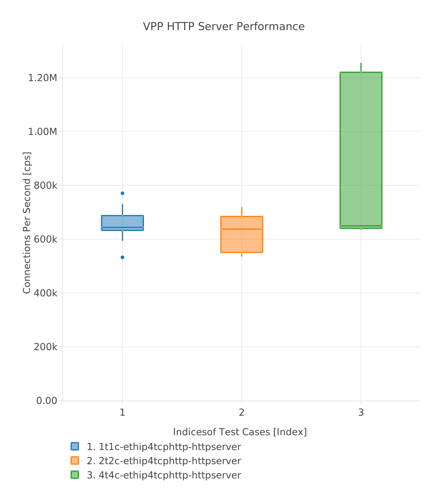
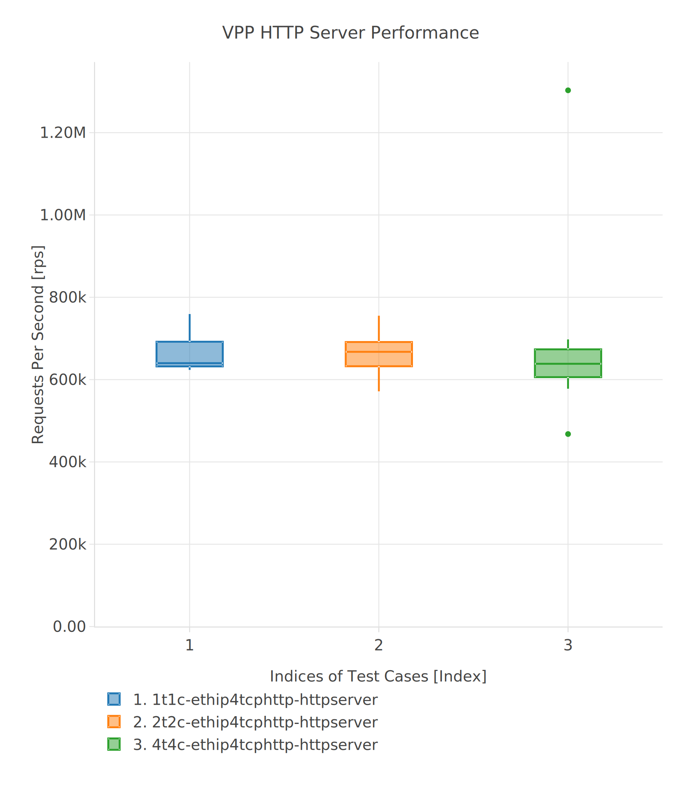

================================
 Envisioning information by PAL
================================

Introduction
------------

This document describes possible improvements in data presentation provided by
PAL for the `Report <https://docs.fd.io/csit/master/report/>`_ and the
`Trending <https://docs.fd.io/csit/master/trending/>`_

You can generate a standalone html version of this document using e.g.
rst2html5 tool:

.. code:: bash

    rst2html5 --stylesheet graphs_improvements.css graphs_improvements.rst >> graphs_improvements.html

**Modifications of existing graphs**

- `Speedup Multi-core`_
- `Packet Throughput`_
- `Packet Latency`_
- `HTTP-TCP Performance`_

**New graphs to be added**

- `Comparison between releases`_
- `Comparison between processor architectures`_
- `Comparison between 2-node and 3-node topologies`_
- `Comparison between different physical testbed instances`_
- `Comparison between NICs`_
- `Other comparisons`_

**Export of static images**

- low priority
- make possible to `export static images`_ which are available via link on the
  web page.
- vector formats (svg, pdf) are preferred

Priorities
----------

**Target CSIT-18.10**

- `Speedup Multi-core`_
- `Packet Throughput`_

**Nice to have in CSIT-18.10**

.. note::

    Only if above done, and target CSIT-18.10 is in time , otherwise next
    release.

- `Packet Latency`_
- `HTTP-TCP Performance`_

Modifications of existing graphs
--------------------------------

The proposed modifications include the changes in:

- the layout of the graphs,
- the data and way how it is presented,
- the test cases presented in the graphs.

The first two points are described below, the last one will be added later as a
separate chapter.

.. _Speedup Multi-core:

Speedup Multi-core
``````````````````

The "Speedup Multicore" graph will display the measured data together with
perfect values calculated as multiples of the best value measured using one
core. The relative difference between measured and perfect values will be
displayed in the hover next to each data point.



**Description:**

*Data displayed:*

- one or more data series from the same area, keep the number of displayed
  data series as low as possible (max 6)
- x-axis: number of cores
- y-axis: throughput (measured and perfect) [Mpps], linear scale, beginning
  with 0
- hover information: Throughput [Mpps], Speedup [1], Relative difference between
  measured and ideal values [%], Perfect Throughput [%]
- Limits of ethernet links, NICs and PCIe. See `Physical performance limits`_.

*Layout:*

- plot type: lines with data points (plotly.graph_objs.Scatter)
- data series format:
    - measured: solid line with data points
    - perfect: dashed line with data points, the same color as "measured"
- title: "Speedup Multi-core: <area, scaling, features, ...>",
  top, centered, font size 18; configurable in specification file: visible /
  hidden, text
- x-axis: integers, starting with 1 (core), linear, font size 16, bottom
- x-axis label: "Number of cores [qty]", bottom, centered, font size 16
- y-axis: float, starting with 0, dynamic range, linear, font size 16, left
- y-axis label: "Packet Throughput [Mpps]", middle, left
- legend: list of presented test cases, bottom, left, font size 16; the order
  of displayed tests is configurable in the specification file
- annotation: text: "dashed: perfect<br>solid: measured", top, left,
  font size 16

.. _Packet Throughput:

Packet Throughput
`````````````````

The "Packet Throughput" graph will display the measured data using
statistical box graph. Each data point is constructed from 10 samples.
The statistical data are displayed as hover information.



**Description:**

*Data displayed:*

- one or more data points from the same area, keep the number of displayed
  data points as low as possible (max 6)
- x-axis: indexed test cases
- y-axis: throughput [Mpps], linear scale, beginning with 0
- hover information: statistical data (min, lower fence, q1, median, q3,
  higher fence, max), test case name

*Layout:*

- plot type: statistical box (plotly.graph_objs.Box)
- data series format: box
- title: "Packet Throughput: <area, scaling, features, framesize, cores, ...>",
  top, centered, font size 18; configurable in specification file: visible /
  hidden, text
- x-axis: integers, starting with 1, linear, font size 16, bottom; the order
  of displayed tests is configurable in the specification file
- x-axis label: "Indices of Test Cases [Index]", bottom, centered, font size 16
- y-axis: floats, starting with 0, dynamic range, linear, font size 16, left
- y-axis label: "Packet Throughput [Mpps]", middle, left
- legend: "Indexed Test Cases [idx]", bottom, left, font size 16

.. _Packet Latency:

Packet Latency
``````````````

The "Packet Latency" graph will display the measured data using
statistical box graph. Each data point is constructed from 10 samples.
The statistical data are displayed as hover information.



**Description:**

*Data displayed:*

- one or more data points from the same area, keep the number of displayed
  data points as low as possible (max 6)
- x-axis: data flow directions
- y-axis: latency min/avg/max [uSec], linear scale, beginning with 0
- hover information: statistical data (min, avg, max), test case name, direction

*Layout:*

- plot type: scatter with errors (plotly.graph_objs.Scatter)
- data series format: data point with min amd max values
- title: "Packet Latency: <area, scaling, features, framesize, cores, ...>",
  top, centered, font size 18; configurable in specification file: visible /
  hidden, text
- x-axis: text, font size 16, bottom; the order of displayed tests is
  configurable in the specification file
- x-axis label: "Direction", bottom, centered
- y-axis: integers, starting with 0, dynamic range, linear, font size 16, left
- y-axis label: "Packet Latency min/avg/max [uSec]", middle, left
- legend: "Indexed Test Cases [idx]", bottom, left, font size 16

.. _HTTP-TCP Performance:

HTTP/TCP Performance
````````````````````

The "HTTP/TCP Performance" graph will display the measured data using
statistical box graph separately for "Connections per second" and "Requests per
second". Each data point is constructed from 10 samples. The statistical data
are displayed as hover information.





**Description:**

*Data displayed:*

- requests / connections per second, the same tests configured for 1, 2 and
  4 cores (3 data points in each graph)
- x-axis: indexed test cases
- y-axis: requests/connections per second, linear scale, beginning with 0
- hover information: statistical data (min, lower fence, q1, median, q3,
  higher fence, max), test case name

*Layout:*

- plot type: statistical box (plotly.graph_objs.Box)
- data series format: box
- title: "VPP HTTP Server Performance", top, centered, font size 18
- x-axis: integers, font size 16, bottom
- x-axis label: "Indices of Test Cases [Index]", bottom, centered, font size 16
- y-axis: floats, starting with 0, dynamic range, linear, font size 16, left
- y-axis label: "Connections per second [cps]", "Requests per second [rps]",
  top, left
- legend: "Indexed Test Cases [idx]", bottom, left, font size 16

New graphs to be added
----------------------

- *Comparison between releases*

    - compare MRR, NDR, PDR between releases
    - use as many releases as available

- *Comparison between processor architectures*

    - compare MRR, NDR, PDR between processor architectures
    - HSW vs SKX (vs ARM when available)

- *Comparison between 2-node and 3-node topologies*

    - compare MRR, NDR, PDR between topologies
    - 3n-skx vs 2n-skx

- *Comparison between different physical testbed instances*

    - compare the results of the same test (MRR, NDR, PDR) run on different
      instances of the same testbed, e.g. HSW
    - HSW vs HSW, SKX vs SKX

- *Comparison between NICs*

    - compare the results of the same test (MRR, NDR, PDR) run on different NICs
      but on the same instance of a physical testbed.
    - x520 vs x710 vs xl710 on HSW
    - x710 vs xxv710 on SKX

- *Other comparisons*

.. note::

    - Partially based on the existing tables in the Report
    - Only selected TCs

.. _Comparison between releases:

Comparison between releases
```````````````````````````

This graph will compare the results of the same test from different releases.
One graph can present the data from one or more tests logically grouped. See
`Grouping of tests in graphs`_ for more information.
Each data point is constructed from 10 samples. The statistical data are
displayed as hover information.

.. image:: pic/graph_cmp_releases.svg
    :width: 800 px
    :scale: 50 %
    :align: center
    :alt: Graph "Comparison between releases" not found.

**Description:**

*Data displayed:*

- data: packet throughput
- x-axis: release
- y-axis: packet throughput [Mpps], linear scale, beginning with 0
- hover information: statistical data (median, stdev), test case name, release

*Layout:*

- plot type: scatter with line
- data series format: line with markers
- title: "Packet Throughput: <area, scaling, features, framesize, cores, ...>",
  top, centered, font size 18
- x-axis: strings, font size 16, bottom
- x-axis label: "Release", bototm, centered, font size 16
- y-axis: floats, starting with 0, dynamic range, linear, bottom, font size 16
- y-axis label: "Packet Throughput [Mpps]", middle, left, font size 16
- legend: "Test Cases", bottom, left, font size 16

.. _Comparison between processor architectures:

Comparison between processor architectures
``````````````````````````````````````````

This graph will compare the results of the same test from the same release run
on the different processor architectures (HSW, SKX, later ARM).
One graph can present the data from one or more tests logically grouped. See
`Grouping of tests in graphs`_ for more information.
Each data point is constructed from 10 samples. The statistical data are
displayed as hover information.

.. image:: pic/graph_cmp_arch.svg
    :width: 800 px
    :scale: 50 %
    :align: center
    :alt: Graph "Comparison between processor architectures" not found.

**Description:**

*Data displayed:*

- data: packet throughput
- x-axis: processor architecture
- y-axis: throughput [Mpps], linear scale, beginning with 0
- hover information: statistical data (median, stdev), test case name, processor
  architecture

*Layout:*

- plot type: scatter with line
- data series format: line with markers
- title: "Packet Throughput: <area, scaling, features, framesize, cores, ...>",
  top, centered, font size 18
- x-axis: strings, font size 16, bottom, centered
- x-axis label: "Processor architecture", bottom, centered, font size 16
- y-axis: floats, starting with 0, dynamic range, linear, font size 16, left
- y-axis label: "Packet Throughput [Mpps]", middle, left
- legend: "Test cases", bottom, left, font size 16

.. _Comparison between 2-node and 3-node topologies:

Comparison between 2-node and 3-node topologies
```````````````````````````````````````````````

This graph will compare the results of the same test from the same release run
on the same processor architecture but different topologies (3n-skx, 2n-skx).
One graph can present the data from one or more tests logically grouped. See
`Grouping of tests in graphs`_ for more information.
Each data point is constructed from 10 samples. The statistical data are
displayed as hover information.

.. image:: pic/graph_cmp_topo.svg
    :width: 800 px
    :scale: 50 %
    :align: center
    :alt: Graph "Comparison between 2-node and 3-node topologies" not found.

**Description:**

*Data displayed:*

- data: packet throughput
- x-axis: topology
- y-axis: throughput [Mpps], linear scale, beginning with 0
- hover information: statistical data (median, stdev), test case name, topology

*Layout:*

- plot type: scatter with line
- data series format: line with markers
- title: "Packet Throughput: <area, scaling, features, framesize, cores, ...>",
  top, centered, font size 18
- x-axis: strings, font size 16, bottom, centered
- x-axis label: "Topology", bottom, centered, font size 16
- y-axis: floats, starting with 0, dynamic range, linear, font size 16, left
- y-axis label: "Packet Throughput [Mpps]", middle, left, font size 16
- legend: "Test cases", bottom, left, font size 16

.. _Comparison between different physical testbed instances:

Comparison between different physical testbed instances
```````````````````````````````````````````````````````

This graph will compare the results of the same test from the same release run
on the same processor architecture, the same topology but different physical
testbed instances.
One graph can present the data from one or more tests logically grouped. See
`Grouping of tests in graphs`_ for more information.
Each data point is constructed from 10 samples. The statistical data are
displayed as hover information.


.. image:: pic/graph_cmp_testbed.svg
    :width: 800 px
    :scale: 50 %
    :align: center
    :alt: Graph "Comparison between different physical testbed instances" not
          found.

**Description:**

*Data displayed:*

- data: packet throughput
- x-axis: physical testbed instances
- y-axis: throughput [Mpps], linear scale, beginning with 0
- hover information: statistical data (median, stdev), test case name, physical
  testbed instance

*Layout:*

- plot type: scatter with line
- data series format: line with markers
- title: "Packet Throughput: <area, scaling, features, framesize, cores, ...>",
  top, centered, font size 18
- x-axis: strings, font size 16, bottom, centered
- x-axis label: "Physical Testbed Instance", bottom, centered, font size 16
- y-axis: floats, starting with 0, dynamic range, linear, font size 16, left
- y-axis label: "Packet Throughput [Mpps]", middle, left, font size 16
- legend: "Test cases", bottom, left, font size 16

.. _Comparison between NICs:

Comparison between NICs
```````````````````````

This graph will compare the results of the same test from the same release run
on the same processor architecture, the same topology but different NICs.
One graph can present the data from one or more tests logically grouped. See
`Grouping of tests in graphs`_ for more information.
Each data point is constructed from 10 samples. The statistical data are
displayed as hover information.

.. image:: pic/graph_cmp_nics.svg
    :width: 800 px
    :scale: 50 %
    :align: center
    :alt: Graph "Comparison between NICs" not found.

**Description:**

*Data displayed:*

- data: packet throughput
- x-axis: NICs
- y-axis: packet throughput [Mpps], linear scale, beginning with 0
- hover information: statistical data (median, stdev), test case name, NIC

*Layout:*

- plot type: scatter with line
- data series format: line with markers
- title: "Packet Throughput: <area, scaling, features, framesize, cores, ...>",
  top, centered, font size 18
- x-axis: strings, font size 16, bottom
- x-axis label: "NIC", bottom, centered, font size 16
- y-axis: floats, starting with 0, dynamic range, linear, font size 16, left
- y-axis label: "Packet Throughput [Mpps]", middle, left, font size 16
- legend: "Test cases", bottom, left, font size 16

.. _Other comparisons:

Other comparisons
`````````````````

**Other tests results comparisons**

- compare packet throughput for vhost vs memif

**Other views on collected data**

- per `Vratko Polak email on csit-dev <https://lists.fd.io/g/csit-dev/message/3008>`_.

.. _Grouping of tests in graphs:

Grouping of tests in graphs
---------------------------

A graph can present results of one or more tests. The tests are grouped
according to the defined criteria. In the ideal case, all graphs use the same
groups of tests.

The grouping of tests is described in a separate document.

.. TODO: [MK], [TF]: Create the document.
.. TODO: [TF]: Add the link.
.. TODO: [TF]: Remove/edit the next paragraph when the document is ready.

**Example of data grouping:**

- ip4: ip4base, ip4scale20k, ip4scale200k, ip4scale2m
    - data presented in this order from left to right
- ip6: similar to ip4
- l2bd: similar to ip4.

.. _Sorting of tests presented in a graph:

Sorting of tests presented in a graph
-------------------------------------

It is possible to specify the order of tests (suites) on the x-axis presented in
a graph:

- `Packet Throughput`_
- `Packet Latency`_

It is possible to specify the order of tests (suites) in the legend presented in
a graph:

- `Speedup Multi-core`_

In both cases the order is defined in the specification file for each plot
separately, e.g.:

.. code:: yaml

    -
      type: "plot"
      <other parameters>
      sort:
      - "IP4BASE"
      - "FIB_20K"
      - "FIB_200K"
      - "FIB_2M"

The sorting is based on tags. If more then one test has the same tag, only the
first one is taken. The remaining tests and the tests without listed tags are
placed at the end of the list in random order.

.. _export static images:

Export of static images
-----------------------

Not implemented yet. For more information see:

- `Plotly: Static image export <https://plot.ly/python/static-image-export/>`_
- prefered vector formats (svg, pdf)
- requirements:
    - plotly-orca
        - `Orca <https://github.com/plotly/orca>`_
        - `Orca releases <https://github.com/plotly/orca/releases>`_
        - `Orca management in Python <https://plot.ly/python/orca-management/>`_
    - psutil

.. _Physical performance limits:

Physical performance limits
---------------------------

+-----------------+----------------+
| Ethernet links  | pps @64B       |
+=================+================+
|  10ge           |  14,880,952.38 |
+-----------------+----------------+
|  25ge           |  37,202,380.95 |
+-----------------+----------------+
|  40ge           |  59,523,809.52 |
+-----------------+----------------+
|  100ge          | 148,809,523.81 |
+-----------------+----------------+


+-----------------+----------------+
| Ethernet links  | bps            |
+=================+================+
| 64B             |                |
+-----------------+----------------+
| IMIX            |                |
+-----------------+----------------+
| 1518B           |                |
+-----------------+----------------+
| 9000B           |                |
+-----------------+----------------+


+-----------------+----------------+
| NIC             | pps @64B       |
+=================+================+
| x520            | 24,460,000     |
+-----------------+----------------+
| x710            | 35,800,000     |
+-----------------+----------------+
| xxv710          | 35,800,000     |
+-----------------+----------------+
| xl710           | 35,800,000     |
+-----------------+----------------+


+-----------------+----------------+
| NIC             | bw ??B         |
+=================+================+
| x520            |                |
+-----------------+----------------+
| x710            |                |
+-----------------+----------------+
| xxv710          |                |
+-----------------+----------------+
| xl710           |                |
+-----------------+----------------+


+-----------------+----------------+
| PCIe            | bps            |
+=================+================+
| PCIe Gen3 x8    | 50,000,000,000 |
+-----------------+----------------+
| PCIe Gen3 x16   | 100,000,000,000|
+-----------------+----------------+


+-----------------+----------------+
| PCIe            | pps @64B       |
+=================+================+
| PCIe Gen3 x8    |  74,404,761.90 |
+-----------------+----------------+
| PCIe Gen3 x16   | 148,809,523.81 |
+-----------------+----------------+
