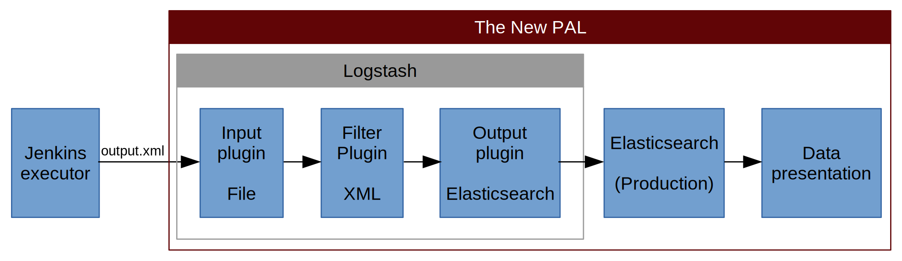
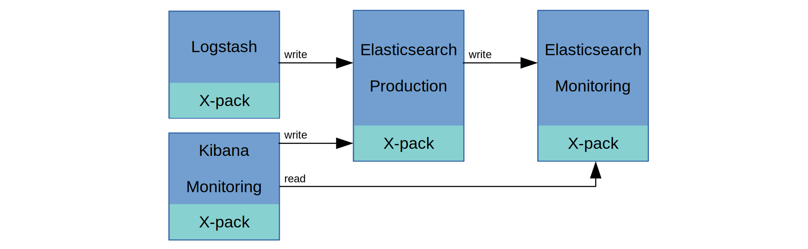

The New PAL
===========

Hardware
--------

Three servers in a cluster. HW Specification:

..
    TODO:

- Processor:
- RAM:
- Disc:
- Connectivity:

Architecture
------------

The system consists of two parts:

- Processing of the results of tests generated by LF Jenkins (Data source).
  It includes these sub-systems:

    - Data store
    - Data search
    - Data processing
    - Data visualisation

- Monitoring of the system. The system itself is monitored to prevent and/or
  detect critical situations and watch how it is used. It includes these
  sub-systems (separate production and monitoring clusters):

   - Data store
   - Data search
   - Data visualisation

Data
````



    *Fig 1: Proposed structure of the Data Processing and Visualization system.*

- Data source: Jenkins executor (output.xml)
- Data store: Logstash [Logstash]_
    - Input plugin: File [File]_
    - Filter plugin: XML [XML]_
    - Output plugin: Elasticsearch [ElasticsearchPlugin]_
- Data search: Elasticsearch [Elasticsearch]_
- Data processing and visualisation: Plotly Dash [Dash]_

Data store
''''''''''

..
    TODO:


Data search
'''''''''''

..
    TODO:


Data processing and visualisation
'''''''''''''''''''''''''''''''''

..
    TODO:


Monitoring and Alerting
```````````````````````



    *Fig 2: Proposed structure of the Monitoring and Alerting system.*

Possible solutions:

..
    TODO:

- [Monitoring]_
- [Alerting]_


Links
-----

.. [Logstash] `Elastic Logstash <https://www.elastic.co/products/logstash>`_
.. [File] `File Input Plugin <https://www.elastic.co/guide/en/logstash/current/plugins-inputs-file.html>`_
.. [XML] `XML Filter Plugin <https://www.elastic.co/guide/en/logstash/current/plugins-filters-xml.html>`_
.. [ElasticsearchPlugin] `Elasticsearch Output Plugin <https://www.elastic.co/guide/en/logstash/current/plugins-outputs-elasticsearch.html>`_
.. [Elasticsearch] `Elastic Elasticsearch <https://www.elastic.co/products/elasticsearch>`_
.. [Monitoring] `Elastic Monitoring <https://www.elastic.co/products/stack/monitoring>`_
.. [Alerting] `Elastic Aletring <https://www.elastic.co/products/stack/alerting>`_
.. [Dash] `Plotly Dash <https://plot.ly/products/dash/>`_
